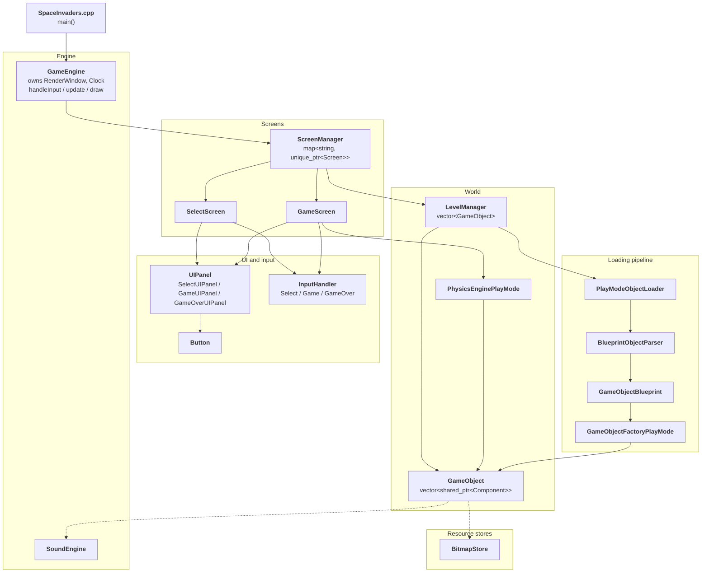
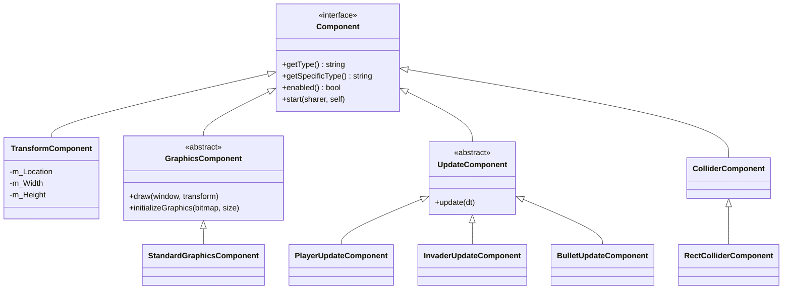
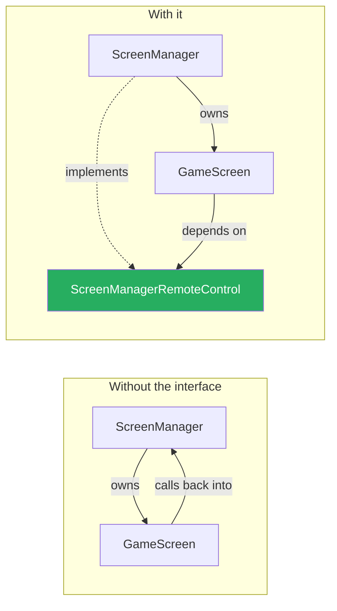
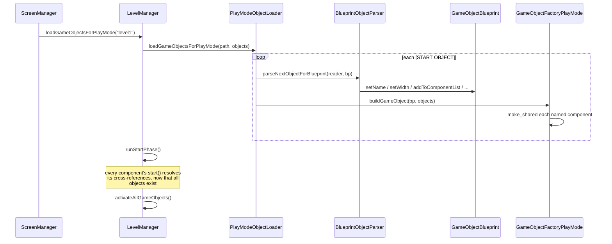

# 01 — Architecture overview

## Overview

The game is about 3,000 lines across ~40 classes, and it separates cleanly into
four layers: an **engine** that owns the window and the loop, **screens** that
represent what you are currently looking at, **game objects** assembled from
**components**, and a **loading pipeline** that builds those objects from a text
file.

The high-level design is sound. Two of its interfaces — `ScreenManagerRemoteControl`
and `BulletSpawner` — are genuine dependency inversion, and the component model
is coherent. The defects documented in [primer 09](09-bug-catalogue.md) were
almost entirely in the details, not the skeleton. That distinction is worth
holding onto when you re-read this: you got the shape right.

## ELI5

Think of a theatre.

- The **engine** is the building: it owns the stage, keeps the lights on, and
  runs the same three steps forever — listen to the audience, advance the story,
  redraw the scene.
- A **screen** is a scene. Only one is on stage at a time. There's a menu scene
  and a gameplay scene.
- A **game object** is an actor. Actors are not specialised by birth; they're
  specialised by what they carry. Give one a costume, a script, and a position
  and it's an invader. Same actor, different props, and it's a bullet.
- The **loading pipeline** is the stage crew reading a scene list and putting the
  right actors in the right places before the curtain rises.

The clever part — and it's the part you'd want to keep — is that a scene never
knows the building's name. It holds a *remote control* with a few buttons on it
("switch scene", "load a level"). The building supplies the remote. So the scene
can be tested, replaced, or reused without dragging the whole theatre along.

## For a SWE

### The layers



### The loop

`GameEngine::run()` is the whole thing:

```cpp
while (m_Window.isOpen())
{
    m_DT = m_Clock.restart();
    m_DeltaTimeSeconds = m_DT.asSeconds();   // clamped to 0.1s
    handleInput();
    update();
    draw();
}
```

Each of those three delegates straight to `ScreenManager`, which delegates to
whichever `Screen` is current. Nothing else in the codebase has a loop over
frames — everything downstream is "here is how much time passed, advance
yourself."

> That `m_DeltaTimeSeconds` was called `m_FPS` for the life of the project, and
> the misnomer propagated into every `update(float fps)` signature. It has always
> held seconds elapsed — delta time, the *reciprocal* of a rate. Renaming it
> touched 15 files.

### Composition over inheritance: the component model

A `GameObject` is deliberately not subclassed. There is no `Invader` class. There
is one `GameObject` holding a vector of components:

```cpp
class GameObject {
    vector<shared_ptr<Component>> m_Components;
    string m_Tag;
    // ...plus cached indices into m_Components
};
```

What makes an invader an invader is its component list, which comes from the
level file:

```
[NAME]invader[-NAME]
[COMPONENT]Standard Graphics[-COMPONENT]
[COMPONENT]Invader Update[-COMPONENT]
[COMPONENT]Transform[-COMPONENT]
```

The component hierarchy:



`TransformComponent` originally derived from `GraphicsComponent`, which was a
modelling error with three consequences — see
[primer 09 §13](09-bug-catalogue.md#13--a-modelling-error-not-a-typo).

**The cost of this design**, and it's worth seeing clearly: `GameObject` caches
positions into its own component vector.

```cpp
int m_FirstUpdateComponentLocation = -1;
int m_GraphicsComponentLocation = -1;
int m_TransformComponentLocation = -1;
```

These are set in `addComponent` by comparing `getType()` against string literals.
That is three fragile things at once — runtime string comparison, a sentinel
`-1` that is undefined behaviour if it reaches `operator[]`, and an index that
silently goes stale if components are ever removed. Replacing the string tags
with `enum class` is the main remaining architectural cleanup.

### Dependency inversion, done right — twice

This is the part of the design most worth understanding, because it's the part
you'd carry to another project.

`GameScreen` needs to tell the screen manager "load a level and switch to me."
The naive version has `GameScreen` hold a `ScreenManager*`. But `ScreenManager`
already owns `GameScreen` — so they'd include each other's headers, and neither
could be compiled or tested alone.

Instead:

```cpp
class ScreenManagerRemoteControl
{
    public:
        virtual ~ScreenManagerRemoteControl() = default;
        virtual void switchScreens(string screenToSwitchTo) = 0;
        virtual void loadLevelInPlayMode(string screenToLoad) = 0;
        virtual vector<GameObject>& getGameObjects() = 0;
        virtual GameObjectSharer& shareGameObjectSharer() = 0;
};

class ScreenManager : public ScreenManagerRemoteControl { /* ... */ };
```

`GameScreen` holds a `ScreenManagerRemoteControl*`. It depends on an interface it
could satisfy with a test double; `ScreenManager` depends on `Screen`. The arrow
that would have been a cycle now points one way through an abstraction.



The same pattern appears again for bullets. An invader must be able to request a
bullet, but must not know about `GameScreen`:

```cpp
class BulletSpawner
{
    public:
        virtual ~BulletSpawner() = default;
        virtual void spawnBullet(sf::Vector2f spawnLocation, bool forPlayer) = 0;
};

class GameScreen : public Screen, public BulletSpawner { /* ... */ };
```

`InvaderUpdateComponent` holds a `BulletSpawner*`. That interface is why the
headless test harness could drive the whole simulation without a window — it just
supplied its own recording implementation.

`GameObjectSharer` is the third instance, letting a component find *other*
objects ("where is the Player?") without knowing about `LevelManager`.

### The loading pipeline



The two-phase construction is the important detail. Components cannot resolve
references to each other during building, because the objects they point at may
not exist yet. So construction is split: the factory builds everything, and
*then* `runStartPhase()` calls `start()` on every component, at which point
`gos->findFirstObjectWithTag("Player")` is guaranteed to work.

This is the same problem a DI container solves, done by hand.

### An invariant worth writing down

`LevelManager` stores objects by value:

```cpp
vector<GameObject> m_GameObjects;
```

and other systems keep references *into* that vector:

```cpp
GameObject* m_Player;                    // PhysicsEnginePlayMode
vector<int> m_BulletObjectLocations;     // GameScreen
```

`vector` reallocates on growth, which invalidates every pointer and iterator into
it. This code is safe only because of an unstated rule: **all cross-references
are taken after loading finishes, and the whole vector is rebuilt from scratch on
each level load.** Both `PhysicsEnginePlayMode::initialize` and
`GameInputHandler::initialize` re-resolve their pointers on every load, which is
what keeps them valid.

That invariant is now stated in the header where the pointer lives. It is the
kind of thing that is obvious while you're writing it and invisible two years
later.

### Where the global state lives

`WorldState` is a bag of mutable statics — score, lives, wave number, invader
count:

```cpp
class WorldState {
    public:
        static const int WORLD_WIDTH = 100;
        static int WORLD_HEIGHT;
        static int SCORE;
        static int LIVES;
        // ...
};
```

Their *definitions* used to be scattered across four unrelated translation units:
`WORLD_HEIGHT` in `GameScreen.cpp`, `WAVE_NUMBER` in `SelectInputHandler.cpp`,
`SCORE` and `LIVES` in `GameUIPanel.cpp`. That links, but it means a UI file owned
the storage for gameplay state. They now live in `WorldState.cpp`.

Global mutable state is the design's weakest point — it is why the physics engine,
the UI panels, and the update components are all coupled to each other invisibly.
Threading it through explicitly would be a larger change than this project needs,
but it's the thing to notice if you build the next one.

## Related

- [09 — The bug catalogue](09-bug-catalogue.md)
- [10 — Testing C++ with doctest](10-testing.md)
