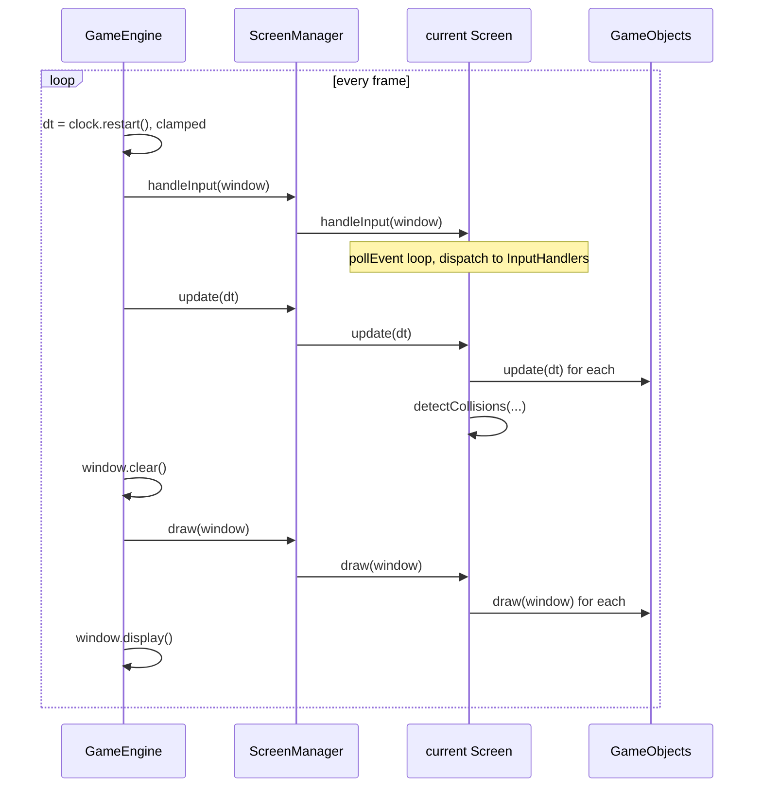

# 02 — The game loop

## Overview

Every real-time program has one loop at its heart: read input, advance the
simulation, draw the result, repeat. In this game it is nine lines in
`GameEngine::run()`, and everything else in the codebase hangs off it.

The interesting part is not the loop itself but the number it passes down —
**delta time**, the seconds elapsed since the previous frame. Get that wrong and
the game runs at a different speed on different machines, or teleports objects
through each other after a stall. Both bugs were present here.

## ELI5

Imagine flipbook animation, except you don't get to decide how fast the pages
turn — the reader does, and they're inconsistent.

So you don't draw "the ship moves 2cm to the right on each page." You draw "the
ship moves 50cm per second," and before drawing each page you ask *how long since
the last page?* If it was a fiftieth of a second, move 1cm. If the reader got
distracted and it was a whole second, move 50cm.

Now the ship travels at the same real-world speed whether the pages turn fast or
slow. That "how long since last time" number is delta time, and almost every
moving thing in the game is multiplied by it.

The catch: if the reader wanders off for a minute and comes back, that one page
would move the ship 50 metres — straight through everything in between. So you
cap it.

## For a SWE

### The loop

```cpp
void GameEngine::run()
{
    const float maxDeltaTimeSeconds = 0.1f;

    while (m_Window.isOpen())
    {
        m_DT = m_Clock.restart();
        m_DeltaTimeSeconds = m_DT.asSeconds();
        if (m_DeltaTimeSeconds > maxDeltaTimeSeconds)
        {
            m_DeltaTimeSeconds = maxDeltaTimeSeconds;
        }

        handleInput();
        update();
        draw();
    }
}
```

`Clock::restart()` returns the elapsed time *and* resets the clock in one call,
which is why there is no separate "previous time" variable.

The three phases delegate straight through:



Note the ordering: **input, then update, then draw.** Input first means a
keypress affects the same frame it arrived in rather than the next one. Draw last
means you render the state you just computed.

### Delta time, and the two bugs that lived here

**The variable was called `m_FPS`.** It has always held seconds-per-frame — delta
time — which is the *reciprocal* of a frame rate. The misnomer propagated into
every `update(float fps)` signature in the codebase, so every component was
written against a parameter whose name said the opposite of its meaning. Renaming
it to `dt` touched 15 files.

That is worth dwelling on: nothing was functionally wrong, and it still cost real
comprehension. A name that lies is a bug in the reader's head.

**There was no cap and no frame limit.** Two consequences:

```cpp
m_Window.setFramerateLimit(60);            // added, in the constructor
const float maxDeltaTimeSeconds = 0.1f;    // added, in run()
```

Without the limit the loop spins as fast as the hardware allows, burning a core
to redraw an idle menu. Without the clamp, any stall — the first frame after a
level load, dragging the window, a breakpoint — produces one enormous `dt`.

The clamp matters more than it looks, because of how collision works here.
Movement is applied as `position += speed * dt`, and collision is tested
*afterwards*, at the new position:

```
dt = 0.016s  ->  bullet moves 1.2 world units  ->  overlaps the invader  -> hit
dt = 2.0s    ->  bullet moves 150 world units  ->  is now past the invader -> miss
```

The bullet was never *at* the invader on any tested frame. This is **tunnelling**,
and it is the standard argument for a fixed timestep — accumulate real time and
run the simulation in fixed-size steps, so `dt` is constant regardless of frame
rate:

```cpp
// The usual fixed-timestep shape. Not what this game does.
accumulator += frameTime;
while (accumulator >= FIXED_DT)
{
    update(FIXED_DT);
    accumulator -= FIXED_DT;
}
render(accumulator / FIXED_DT);   // interpolate for smoothness
```

This game uses variable timestep with a clamp, which is the simpler choice and
adequate here: speeds are low (bullets move 75 world units/second across a
100-unit world), so at 60fps a bullet advances ~1.25 units per frame against
2-unit-tall targets. Tunnelling needs roughly a 100ms stall, which the clamp
prevents. Worth knowing the trade-off you made, not worth changing.

### Where the frame actually goes

Measured with `SpaceInvadersBench` (60 objects, rendering excluded):

| Phase | Mean | Share of a 60fps frame |
|---|---|---|
| `GameObject::update` × all | 3.9 µs | 0.023% |
| `detectCollisions` | 9.1 µs | 0.054% |
| **Simulation total** | **13.0 µs** | **0.078%** |

The simulation uses under a tenth of a percent of the budget. Everything else is
rendering and `setFramerateLimit` sleeping. See
[primer 11](11-performance.md) for how that was measured and what it found.

### One subtlety in the input phase

`Screen::handleInput` runs the event loop:

```cpp
Event event;
while (window.pollEvent(event))
{
    for (auto it = m_InputHandlers.begin(); it != m_InputHandlers.end(); ++it)
    {
        (*it)->handleInput(window, event);
    }
}
```

`pollEvent` drains a queue — it returns `false` when empty, so one frame may
process zero events or ten. Every handler on the current screen sees every event;
the handlers decide what is theirs.

The iterator used to be declared *outside* the `while`. After the first event it
already equalled `end()`, so every subsequent event that frame was pulled off the
queue and silently discarded. Two keys in one frame meant only the first was
seen. See [primer 09 §9](09-bug-catalogue.md).

## Related

- [01 — Architecture overview](01-architecture-overview.md)
- [07 — Collision detection](07-collision-detection.md) — why the clamp matters
- [11 — Performance](11-performance.md)
