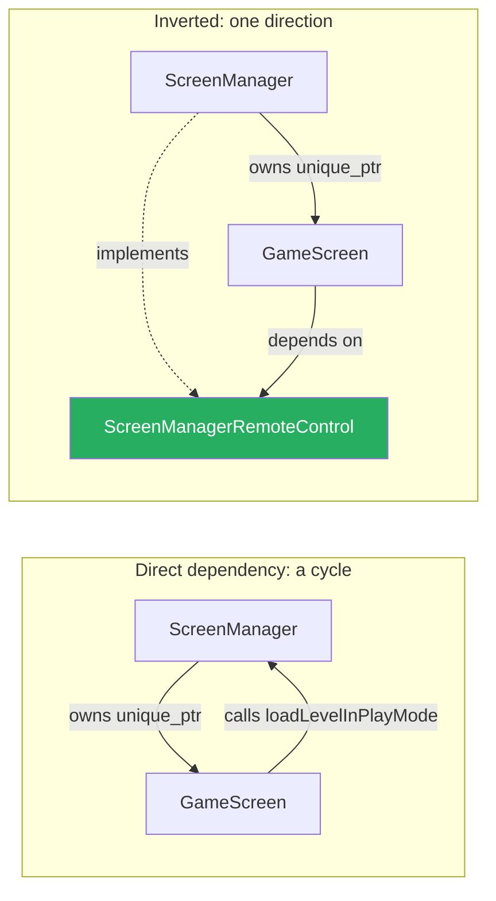

# 03 — Screens and dependency inversion

## Overview

The game has two screens — a menu and the game itself — and only one is active at
a time. `ScreenManager` owns them in a `map<string, unique_ptr<Screen>>` and
forwards `handleInput`/`update`/`draw` to whichever is current.

The part worth studying is how a screen talks *back*. `GameScreen` needs to say
"load a level and switch to me," but `ScreenManager` already owns `GameScreen`.
Wire that directly and you get a dependency cycle neither class can be compiled
or tested without.

The solution here — `ScreenManagerRemoteControl` — is genuine dependency
inversion, and it is the single best piece of design in this codebase. It appears
three times: for screen control, for bullet spawning, and for object lookup.

## ELI5

You're a stage actor. You need the lights dimmed for your scene.

The bad version: you learn the name of the lighting technician, walk to the booth
mid-performance, and flip the switch yourself. Now your performance only works in
*this* theatre, with *this* technician, and if they rearrange the booth you break.

The good version: you have a small remote with three labelled buttons — "dim
lights", "next scene", "where is the other actor?". You press a button. You have
no idea who is on the other end, and you don't care. The theatre handed you the
remote when you arrived.

Now you can rehearse anywhere. Someone can hand you a *fake* remote that just
writes down which buttons you pressed, and check you did the right thing without
building a theatre at all. That fake remote is how the collision tests work.

## For a SWE

### The cycle, and how the interface breaks it

Naively, `GameScreen` holds a `ScreenManager*`:



`ScreenManager.h` includes `GameScreen.h` (it constructs one). If `GameScreen.h`
included `ScreenManager.h`, neither header could be parsed. You could paper over
that with a forward declaration, but the design problem remains: `GameScreen`
would be untestable without a whole `ScreenManager`, which needs a `LevelManager`,
which needs a level file on disk.

The interface:

```cpp
class ScreenManagerRemoteControl
{
    public:
        virtual ~ScreenManagerRemoteControl() = default;

        virtual void switchScreens(std::string screenToSwitchTo) = 0;
        virtual void loadLevelInPlayMode(std::string screenToLoad) = 0;
        virtual std::vector<GameObject>& getGameObjects() = 0;
        virtual GameObjectSharer& shareGameObjectSharer() = 0;
        virtual SoundPlayer& shareSoundPlayer() = 0;
};

class ScreenManager : public ScreenManagerRemoteControl { /* ... */ };
```

`GameScreen` holds a `ScreenManagerRemoteControl*`. The concrete class depends on
the abstraction; the abstraction depends on nothing. That is the *inversion* —
the arrow that would have pointed back up now points at an interface instead.

> **The name is doing work.** "RemoteControl" says exactly what this is: a small
> panel of buttons, not the whole machine. That framing is why the interface
> stayed at five methods instead of growing into a mirror of `ScreenManager`.

### The same pattern, twice more

**`BulletSpawner`** — an invader must be able to request a bullet without knowing
about `GameScreen`:

```cpp
class BulletSpawner
{
    public:
        virtual ~BulletSpawner() = default;
        virtual void spawnBullet(sf::Vector2f spawnLocation, bool forPlayer) = 0;
};

class GameScreen : public Screen, public BulletSpawner { /* ... */ };
```

`InvaderUpdateComponent` holds a `BulletSpawner*`. This is what let the benchmark
and the physics tests drive the entire simulation with no screen at all:

```cpp
class CountingBulletSpawner : public BulletSpawner
{
    public:
        long requests = 0;
        void spawnBullet(sf::Vector2f, bool) override { ++requests; }
};
```

**`GameObjectSharer`** — a component needs to find *other* objects ("where is the
Player?") without knowing about `LevelManager`:

```cpp
class GameObjectSharer
{
    public:
        virtual ~GameObjectSharer() = default;
        virtual std::vector<GameObject>& getGameObjectsWithGOS() = 0;
        virtual GameObject& findFirstObjectWithTag(std::string tag) = 0;
};
```

The tests implement it over a plain vector in about ten lines.

**`SoundPlayer`** was added later, for exactly the same reason — see
[primer 08](08-resource-management.md). Four interfaces, one idea.

### Why `GameScreen` inherits from two things

```cpp
class GameScreen : public Screen, public BulletSpawner
```

Multiple inheritance has a bad reputation, largely earned by deep hierarchies of
concrete classes with shared state. This is the case where it is uncontroversial:
one concrete base (`Screen`) and one pure interface (`BulletSpawner`) with no
data members. It is what Java would express as `extends Screen implements
BulletSpawner`.

`GameScreen::getBulletSpawner()` returns `this`, upcast to the interface —
handing out one capability of itself without exposing the rest.

### Screen lifetime, and a UB trap

```cpp
std::map<std::string, std::unique_ptr<Screen>> m_Screens;

m_Screens["Game"]   = std::make_unique<GameScreen>(this, res);
m_Screens["Select"] = std::make_unique<SelectScreen>(this, res);
```

`Screen` originally had **no virtual destructor**. Deleting a `GameScreen`
through a `unique_ptr<Screen>` is undefined behaviour — `~GameScreen` never runs,
so its `GameInputHandler` and background texture leak. Clang flags it as
`-Wdelete-non-abstract-non-virtual-dtor`. Every polymorphic base here now
declares `virtual ~T() = default;`. The reasoning, including why
`shared_ptr<Component>` was *not* affected, is in
[primer 05](05-smart-pointers-and-ownership.md).

Screens are constructed once, at startup, and live for the program's lifetime.
Switching is just a string:

```cpp
void switchScreens(std::string screenToSwitchTo) override
{
    m_CurrentScreen = "" + screenToSwitchTo;
    m_Screens[m_CurrentScreen]->initialize();
}
```

Two things to notice. `"" + screenToSwitchTo` is a no-op that forces a copy —
harmless, and a hint the author was working around a bug that was really
elsewhere. And `map::operator[]` **inserts a default-constructed value** if the
key is absent: a typo'd screen name silently inserts a null `unique_ptr<Screen>`
and the next frame dereferences it. `.at()` would throw instead. That one is
still open.

### Panels and input handlers

A screen owns UI panels and input handlers in parallel vectors, wired together by
`addPanel`:

```cpp
void Screen::addPanel(
    std::unique_ptr<UIPanel> uip,
    ScreenManagerRemoteControl* smrc,
    std::shared_ptr<InputHandler> ih)
{
    ih->initializeInputHandler(smrc, uip->getButtons(), &uip->m_View, this);
    m_Panels.push_back(std::move(uip));    // unique_ptr: move, cannot copy
    m_InputHandlers.push_back(ih);
}
```

This is where the remote control reaches the input handlers — which is why
`GameInputHandler` can resolve the player's components, and play sounds, without
knowing what a `ScreenManager` is:

```cpp
void GameInputHandler::initialize()
{
    GameObjectSharer& gos = getPointerToScreenManagerRemoteControl()->shareGameObjectSharer();
    GameObject& player = gos.findFirstObjectWithTag("Player");
    m_PUC = std::static_pointer_cast<PlayerUpdateComponent>(
        player.getComponentByTypeAndSpecificType(ComponentType::Update, ComponentSpecificType::Player));
    // ...
}
```

That function was **empty** until recently, leaving `m_PUC` null while
`InputHandler` dereferenced it on every event — a crash on the first keypress.
The wiring existed; nothing had ever run it.

### The lesson to carry

The three interfaces are small — five methods, one method, two methods. That is
not an accident of an unfinished design; it is the whole point. An interface
exists to express *the minimum one side needs from the other*. Every method you
add is another thing a test double has to implement and another way the two sides
are coupled.

When you build the next thing, the question worth asking at each callback is:
**what is the smallest set of buttons this side actually needs?**

## Related

- [01 — Architecture overview](01-architecture-overview.md)
- [05 — Smart pointers and ownership](05-smart-pointers-and-ownership.md)
- [10 — Testing](10-testing.md) — these interfaces are what made tests possible
