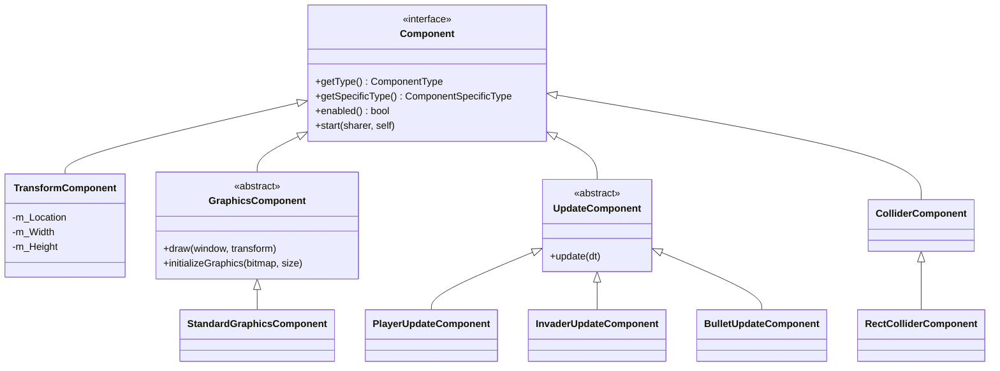

# 04 — The component model

## Overview

There is no `Invader` class in this codebase. There is no `Bullet` class or
`Player` class either. There is one `GameObject`, which holds a list of
components, and what an object *is* comes entirely from which components it
holds — decided by a text file, not by the type system.

This is **composition over inheritance**, and it is the central design decision
of the project. This primer covers why, how it works here, and what it costs.

## ELI5

Two ways to run a costume department.

**Inheritance:** you sew one complete costume per character. A pirate costume, a
knight costume, a pirate-knight costume. When someone wants a knight with a
pirate's hat, you sew a fourth costume from scratch. Ten features means a
thousand costumes.

**Composition:** you keep a rack of separate pieces — hats, boots, coats, swords
— and a plain mannequin. A pirate *is* a mannequin wearing the pirate hat and the
sword. A pirate-knight is a mannequin wearing the pirate hat and the armour. New
combinations cost nothing, because you never sewed the combinations in the first
place.

This game uses the second. `GameObject` is the mannequin. An invader is a
mannequin wearing a position, a sprite, and an "invader behaviour" tag — and the
costume list is written in a text file, so you can change what an invader is
without recompiling anything.

## For a SWE

### The shape

```cpp
class GameObject
{
    private:
        std::vector<std::shared_ptr<Component>> m_Components;

        ObjectTag m_Tag = ObjectTag::Unknown;
        std::string m_TagName;
        bool m_Active = false;

        // Cached positions into m_Components
        int m_FirstUpdateComponentLocation = -1;
        int m_GraphicsComponentLocation = -1;
        int m_TransformComponentLocation = -1;
        int m_FirstRectColliderComponentLocation = -1;
        // ...plus counts and has-a flags
};
```

And the level file decides the contents:

```
[NAME]invader[-NAME]
[COMPONENT]Standard Graphics[-COMPONENT]
[COMPONENT]Invader Update[-COMPONENT]
[COMPONENT]Transform[-COMPONENT]
```

Change `Invader Update` to `Player Update` in that file and the object becomes
player-controlled. No recompilation.

### The hierarchy



Note that inheritance has not disappeared — it moved. It is used *within* each
component family, where "an `InvaderUpdateComponent` is an `UpdateComponent`" is
genuinely true and one level deep. What composition eliminated was inheritance
across the *object* axis, which is where the combinatorial explosion lives.

### Dynamic dispatch, and what it costs

`Component` has pure virtual functions, so it has a **vtable**: a per-class table
of function pointers. Each object stores a hidden pointer to its class's vtable,
and a virtual call goes through it.

```cpp
tempUpdate->update(dt);   // load vtable ptr, load slot, indirect call
```

Roughly: one extra load and an indirect call, and — usually more important — the
target is not known at compile time, so it cannot be inlined.

This is the cost that buys the flexibility. At 60 objects with a handful of
components each it is invisible: the whole simulation runs in 13 µs, under a
tenth of a percent of a frame. See [primer 11](11-performance.md).

The alternative, and the direction real engines go, is a **data-oriented** layout
— one contiguous array per component type, iterated without indirection:

```cpp
// Not what this project does. What an ECS does.
std::vector<Transform> transforms;   // contiguous, cache-friendly
std::vector<Velocity>  velocities;
for (size_t i = 0; i < transforms.size(); ++i) { transforms[i].x += velocities[i].dx * dt; }
```

That trades away the per-object polymorphism for cache locality and is worth it
at tens of thousands of entities. At 60, it would be worse code for no gain.

### `static_pointer_cast`, and why it is a loaded gun

Components are stored as `shared_ptr<Component>`. Getting back to a concrete type
requires a downcast:

```cpp
auto bulletUpdate = std::static_pointer_cast<BulletUpdateComponent>(
    bullet.getFirstUpdateComponent());
```

`static_pointer_cast` performs **no runtime check**. If that component is not
actually a `BulletUpdateComponent`, you get a pointer that is used as one, and
the corruption surfaces somewhere unrelated. `dynamic_pointer_cast` *does* check,
returning null on failure, at the cost of an RTTI lookup.

This codebase uses `static_pointer_cast` throughout, which is defensible only
because the lookup that precedes it is exact:

```cpp
m_TC = std::static_pointer_cast<TransformComponent>(
    self->getComponentByTypeAndSpecificType(ComponentType::Transform,
                                            ComponentSpecificType::Transform));
```

The safety argument is: *the lookup can only return a component whose type and
specific type match, and only `TransformComponent` reports that pair.* That
argument held right up until the lookup's failure path returned
`m_Components[0]` — the wrong component, cast blindly to the wrong type. It now
throws instead. See [primer 09 §2](09-bug-catalogue.md).

> If you rebuild this, consider a template accessor that pairs the enum with the
> type — `get<TransformComponent>()` — so the cast and the lookup key cannot
> disagree.

### The cached-index optimisation, and its sharp edge

`GameObject` does not search its component list on every access. It records
positions as components are added:

```cpp
void GameObject::addComponent(std::shared_ptr<Component> component)
{
    m_Components.push_back(component);
    component->enableComponent();

    if (component->getType() == ComponentType::Update)
    {
        m_HasUpdateComponent = true;
        m_NumberUpdateComponents++;
        if (m_NumberUpdateComponents == 1)
        {
            m_FirstUpdateComponentLocation = m_Components.size() - 1;
        }
    }
    // ...graphics, transform, collider
}
```

Update components are assumed **contiguous**, so `update()` can run a range:

```cpp
for (int i = m_FirstUpdateComponentLocation;
     i < m_FirstUpdateComponentLocation + m_NumberUpdateComponents; i++)
```

That holds only because the factory adds components in list order and never
removes any. It is an invariant with nothing enforcing it.

The sharp edge is the sentinel. `-1` means "not found yet", and
`std::vector::operator[]` takes an **unsigned** `size_type`, so `-1` converts to
`SIZE_MAX` and the implementation computes `data() + SIZE_MAX`, wrapping to just
*before* the array. AddressSanitizer caught this happening for real:

```
ERROR: AddressSanitizer: heap-buffer-overflow
READ of size 8 at 0x602000014960
  #2 GameObject::getTransformComponent() GameObject.cpp:42
0x602000014960 is located 16 bytes before 16-byte region
```

It was reachable because a tag mismatch in the level format meant *no component
was ever built* — every object had an empty component list and every cached index
stayed `-1`. The accessors now throw. The full story is
[primer 09 §4](09-bug-catalogue.md).

### Two-phase construction

Components frequently need references to *other* components, on other objects.
That cannot happen during construction, because the objects being referred to may
not exist yet. So construction is split:

```cpp
void LevelManager::runStartPhase()
{
    for (auto it = m_GameObjects.begin(); it != m_GameObjects.end(); ++it)
    {
        (*it).start(this);          // now everything exists
    }
    activateAllGameObjects();
}
```

`start()` is where an invader finds the player:

```cpp
void start(GameObjectSharer* gos, GameObject* self) override
{
    m_PlayerTC = std::static_pointer_cast<TransformComponent>(
        gos->findFirstObjectWithTag("Player")
           .getComponentByTypeAndSpecificType(ComponentType::Transform,
                                              ComponentSpecificType::Transform));
    m_TC = std::static_pointer_cast<TransformComponent>(
        self->getComponentByTypeAndSpecificType(ComponentType::Transform,
                                                ComponentSpecificType::Transform));
}
```

This is the problem a dependency-injection container solves, done by hand: build
everything, then wire everything. The cost is that a component has two states —
constructed but not started, and started — and nothing in the type system
distinguishes them.

### What this design gets right, and what it costs

**Right:** new behaviour is a new `UpdateComponent`, and new object types are a
level-file edit. The component boundaries are sensible: transform is data,
graphics reads it, update writes it, collider mirrors it.

**Costs, honestly:**

- **Identity is a runtime lookup.** Asking "does this object have a collider?" is
  a flag check; asking for a specific component walks a list. A typed struct
  would answer both at compile time.
- **The cached indices are unenforced invariants.** Contiguity, no removal, `-1`
  meaning absent.
- **Every component is a separate heap allocation** behind a `shared_ptr`, so a
  single object's data is scattered.
- **Two-phase init is invisible to the compiler.** Calling `update()` before
  `start()` dereferences null.

None of these are wrong at this scale. All of them are the reason production
engines end up data-oriented at large scale. Knowing *which* costs you accepted
is the useful part.

## Related

- [05 — Smart pointers and ownership](05-smart-pointers-and-ownership.md)
- [06 — Level loading](06-level-loading.md) — how the component list becomes objects
- [09 — The bug catalogue](09-bug-catalogue.md)
