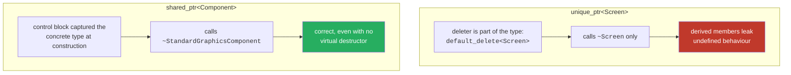

# 05 — Smart pointers and ownership

## Overview

This codebase uses all three of C++'s pointer kinds, and — mostly by accident of
following a book — uses each one in roughly the right place. `unique_ptr` for
exclusive ownership, `shared_ptr` for shared ownership, raw pointers for
non-owning observation.

The interesting material is where the distinctions *bite*: a missing virtual
destructor that is undefined behaviour with `unique_ptr` but harmless with
`shared_ptr`, and raw pointers into a `std::vector` that are valid only because
of an invariant nobody had written down.

## ELI5

Three ways to lend someone a book.

- **`unique_ptr` — you give the book away.** You no longer have it. There is
  exactly one copy and one owner. If you want someone else to have it, you must
  physically hand it over (`std::move`); you cannot photocopy it.
- **`shared_ptr` — a library book with a waiting list.** Several people hold it
  at once, and the library keeps a count. When the last person returns it, it
  gets shredded. Nobody has to know who else is holding it.
- **A raw pointer — you tell someone the shelf number.** They can go read it. But
  you have not promised the book will still be there, and if the library
  reorganises the shelves that number now points at a different book entirely.

The bugs in this project were all in the third category, or in what happens when
you shred a book without checking what kind it was.

## For a SWE

### Where each is used, and why

| Relationship | Type | Why |
|---|---|---|
| `ScreenManager` → its screens | `unique_ptr<Screen>` | One owner, lives until shutdown |
| `Screen` → its UI panels | `unique_ptr<UIPanel>` | Same |
| `GameObject` → its components | `shared_ptr<Component>` | Components hold references to each other |
| `Screen` → its input handlers | `shared_ptr<InputHandler>` | `GameScreen` also keeps its own handle |
| `PhysicsEnginePlayMode` → the player | `GameObject*` | Observation only; the vector owns it |
| `InvaderUpdateComponent` → its spawner | `BulletSpawner*` | Observation only |
| `LevelManager` → its objects | `std::vector<GameObject>` | Values, not pointers at all |

That last row is worth noticing. Game objects are stored **by value** in a
contiguous vector, not as `vector<unique_ptr<GameObject>>`. That is the more
cache-friendly choice, and it is why the raw pointers into it need care.

### The virtual destructor rule, and its exception

This is the most instructive thing in the file.

```cpp
std::map<std::string, std::unique_ptr<Screen>> m_Screens;
m_Screens["Game"] = std::make_unique<GameScreen>(this, res);   // UB without a virtual dtor

std::vector<std::shared_ptr<Component>> m_Components;
m_Components.push_back(std::make_shared<TransformComponent>(...));  // fine either way
```

`Screen` originally had no virtual destructor. Destroying a `GameScreen` through
`unique_ptr<Screen>` is undefined behaviour — the derived destructor never runs.
Clang reports it: `-Wdelete-non-abstract-non-virtual-dtor`.

`Component` had no virtual destructor either, and that was **safe**. Why:

`unique_ptr<T, D>` carries its deleter in its *type*. The default,
`std::default_delete<Screen>`, does exactly `delete static_cast<Screen*>(p)`. It
has no idea a `GameScreen` was ever involved. Without a virtual destructor, only
`~Screen` runs.

`shared_ptr<T>` captures its deleter at **construction**, when the concrete type
is still known, and stores it in the type-erased control block:

```cpp
std::shared_ptr<Component> c = std::make_shared<StandardGraphicsComponent>();
// control block remembers: "call ~StandardGraphicsComponent"
// that survives the conversion to shared_ptr<Component>
```

So `shared_ptr` destroys correctly through a base pointer even with no virtual
destructor. This is **type erasure**, and it is the same mechanism that lets
`shared_ptr<T>` hold a custom deleter without changing its type — which is why
`shared_ptr<T>` and `unique_ptr<T, D>` have different template parameter lists.



**Every polymorphic base here now declares `virtual ~T() = default;` anyway.** The
rule is easier to remember than the exception, the cost is one vtable slot on
classes that already have a vtable, and relying on the exception means a future
change from `shared_ptr` to `unique_ptr` silently introduces UB.

### `std::move`, and why `addPanel` needs it

```cpp
void Screen::addPanel(std::unique_ptr<UIPanel> uip, /* ... */)
{
    m_Panels.push_back(std::move(uip));
}
```

`unique_ptr` has no copy constructor — that is the whole point. `push_back(uip)`
would try to copy and fail to compile. `std::move` casts to an rvalue reference,
selecting the *move* constructor, which transfers the raw pointer and nulls the
source.

After the move, `uip` is still a valid object in a **valid but unspecified
state** — for `unique_ptr` specifically, guaranteed null. You may assign to it or
destroy it; you must not dereference it.

`std::move` itself generates no code. It is a cast that changes overload
resolution.

The original code wrote `move(...)` unqualified, relying on `using namespace
std;` in a header. It worked, but only via ADL and the namespace leak — clang
warns `-Wunqualified-std-cast-call`. Now `std::move`, and the leak is gone
([primer 09 §12](09-bug-catalogue.md)).

### Raw pointers into a vector: the invariant nobody wrote down

```cpp
class PhysicsEnginePlayMode
{
    GameObject* m_Player = nullptr;    // points into LevelManager's vector
};

class GameScreen
{
    std::vector<int> m_BulletObjectLocations;   // indices into the same vector
};
```

`std::vector` guarantees contiguity, and reallocates when it grows — invalidating
**every** pointer, reference, and iterator into it. `GameObjectFactoryPlayMode`
does `gameObjects.push_back(...)` in a loop with no `reserve()`, so loading a
60-object level reallocates several times.

This code is safe, but only because of an unstated rule:

> **All cross-object references are taken after loading completes, and the entire
> vector is rebuilt from scratch on every level load.**

Both `PhysicsEnginePlayMode::initialize` and `GameInputHandler::initialize` are
called from `GameScreen::initialize`, which runs *after* `loadLevelInPlayMode`
has finished rebuilding the vector. That is what keeps the pointers valid.

That invariant is now written in the header where the pointer lives. It is
exactly the kind of thing that is obvious while you are writing it and invisible
two years later — and the sort of assumption that breaks the first time someone
adds an object mid-level.

The components dodge this entirely: they hold `shared_ptr<TransformComponent>`,
and the components live on the heap, so a vector reallocation moves the
`GameObject` shells but not what their components point at.

### `shared_ptr` costs, and one that mattered

`shared_ptr` is two pointers wide and its refcount updates are **atomic** —
correct under threads, but not free in a hot loop. Copying one is an atomic
increment; destroying the copy is an atomic decrement.

This turned out to be the single biggest performance issue in the game:

```cpp
// Before: inside a loop over every (invader, bullet) pair
auto bulletUpdate = std::static_pointer_cast<BulletUpdateComponent>(
    bulletIt->getFirstUpdateComponent());   // returns shared_ptr BY VALUE
```

`getFirstUpdateComponent()` returns a `shared_ptr` by value, so each pair cost an
atomic increment and decrement — 45 invaders × 14 bullets = 630 atomic operations
per frame, to answer a question identical for all 45 invaders. Hoisting it out
made collision detection **4.2× faster** and turned its growth curve from
quadratic to linear. Numbers in [primer 11](11-performance.md).

The general rule: **pass `shared_ptr` by value only when the callee genuinely
takes shared ownership.** For "look at this thing", pass `const T&` or `T*`.

### What is still not ideal

- `getGraphicsComponent()` and `getTransformComponent()` still return `shared_ptr`
  by value, and are called per object per frame in `GameObject::draw`. Not
  measured, because `draw` needs a window the benchmark does not create.
- `UIPanel::getButtons()` returns `vector<shared_ptr<Button>>` **by value**, then
  `addPanel` passes it by value again. Startup-only, so it does not matter — but
  it is the same shape as the bug that did.
- `m_GameObjects` is never `reserve()`d.

None of these are worth changing on current evidence. They are listed so that
"not fixed" reads as a decision rather than an oversight.

## Related

- [04 — The component model](04-component-model.md)
- [11 — Performance](11-performance.md) — the atomic refcount, measured
- [09 — The bug catalogue §8](09-bug-catalogue.md)
