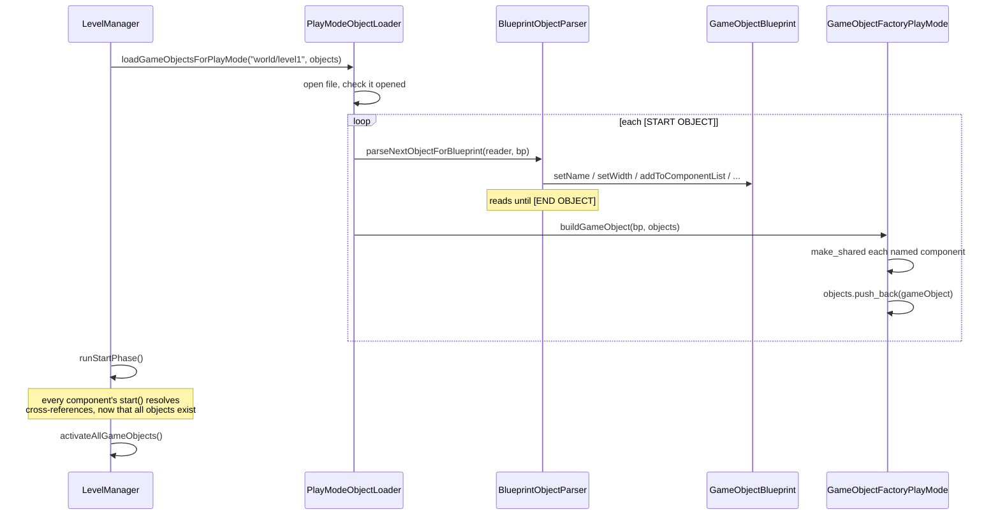

# 06 — Level loading

## Overview

A level is a plain text file. `world/level1` describes 60 objects — 45 invaders,
14 bullets, one player — as tagged blocks giving each object a name, a component
list, a size, a position, and a sprite.

Four classes turn that text into live `GameObject`s, in a pipeline: a **loader**
reads the file, a **parser** fills in a **blueprint**, and a **factory** builds
the object. That separation is worth understanding, because it is what made the
whole path testable — and because the worst bug in the project lived in the seam
between the format and the code that reads it.

## ELI5

Think of assembling flat-pack furniture from a catalogue.

- The **loader** flips through the catalogue looking for "START OF ITEM" markers.
- The **parser** reads one item's page and fills in an order form: name, size,
  colour, which parts are needed.
- The **blueprint** *is* that order form — just filled-in boxes, no furniture yet.
- The **factory** takes the form to the warehouse and actually builds the thing.

Why not read the catalogue and build at the same time? Because then you could
only ever build from a catalogue. With the form in the middle, you can fill one
in by hand to test the factory, or check the form is right without building
anything. Each half can be examined on its own.

## For a SWE

### The pipeline



Each stage has exactly one job, which is why three of the four are unit-tested
without a window.

### The format

```
[START OBJECT]
[NAME]invader[-NAME]
[COMPONENT]Standard Graphics[-COMPONENT]
[COMPONENT]Invader Update[-COMPONENT]
[COMPONENT]Transform[-COMPONENT]
[LOCATION X]0[-LOCATION X]
[LOCATION Y]0[-LOCATION Y]
[WIDTH]2[-WIDTH]
[HEIGHT]2[-HEIGHT]
[BITMAP NAME]invader1[-BITMAP NAME]
[ENCOMPASSING RECT COLLIDER]invader[-ENCOMPASSING RECT COLLIDER]
[END OBJECT]
```

Line-oriented, one tag pair per line, order-independent. The tag strings live in
`ObjectTags.cpp` as named constants — which sounds like it prevents typos, and
did not. More on that below.

### The blueprint is a Data Transfer Object

```cpp
class GameObjectBlueprint
{
    private:
        std::string m_Name = "";
        std::vector<std::string> m_ComponentList;
        std::string m_BitmapName = "";
        float m_Width = 0.f;
        float m_Height = 0.f;
        float m_LocationX = 0.f;
        float m_LocationY = 0.f;
        // ...
};
```

No behaviour, just fields and accessors. That makes it dull — and dull is why the
factory can be handed a hand-built blueprint in a test, with no file involved.

It also made the project's most consequential typo a one-line test to catch:

```cpp
void GameObjectBlueprint::setLocationX(float locationX) { m_Height = locationX; }
void GameObjectBlueprint::setLocationY(float locationY) { m_Height = locationY; }
```

Both location setters wrote the **height**. `m_LocationX` and `m_LocationY` were
never assigned by anything, and had no initialisers, so every object read its
position from an indeterminate value. Nothing would have appeared where the level
file said.

### The factory maps names to types

```cpp
for (auto it = bp.getComponentList().begin(); it != bp.getComponentList().end(); ++it)
{
    if (*it == "Transform")
    {
        gameObject.addComponent(std::make_shared<TransformComponent>(
            bp.getWidth(), bp.getHeight(),
            sf::Vector2f(bp.getLocationX(), bp.getLocationY())));
    }
    else if (*it == "Invader Update") { /* ... */ }
    else if (*it == "Standard Graphics") { /* ... */ }
    // ...
}
```

A string-to-constructor switch. Note what happens on a name the factory does not
recognise: **nothing**. No branch matches, no component is added, no error is
raised. The object is built anyway, missing that capability, and fails much later
when something asks for it.

That silence is what made the next bug so hard to see.

### The bug in the seam

`ObjectTags.cpp` declared:

```cpp
const std::string ObjectTags::COMPONENT     = "[COMPONENT]";
const std::string ObjectTags::COMPONENT_END = "[-END COMPONENT]";
```

Every level file writes `[-COMPONENT]`. Different strings — and the declared one
was the outlier, since every other closing tag follows the `[-X]` convention.

Now the part that hid it. The extractor did not search for tags; it sliced by
their **lengths**:

```cpp
int start = startTag.length();
int count = stringToSearch.length() - startTag.length() - endTag.length();
return stringToSearch.substr(start, count);
```

So instead of failing, it returned a plausible-looking truncation:

```
"[COMPONENT]Standard Graphics[-COMPONENT]"   length 40
start = 11, count = 40 - 11 - 16 = 13   ->   "Standard Grap"
```

`"Standard Grap"` matched none of the factory's cases. **Every object in every
level was built with no graphics, no transform, and no update component.** The
game would have rendered an empty screen.

A length-based slice has a second, nastier property: it produces the *correct*
answer whenever the two tags happen to be the same length. That is precisely why
a second mismatch in the same file — `[-ENCOMPASSING_RECT COLLIDER]` in the data
versus `[-ENCOMPASSING RECT COLLIDER]` declared, both 29 characters — parsed
correctly *by coincidence* for years.

The rewrite searches:

```cpp
const size_t startTagPosition = stringToSearch.find(startTag);
if (startTagPosition == std::string::npos) { return ""; }

const size_t valueStart = startTagPosition + startTag.length();
const size_t endTagPosition = stringToSearch.find(endTag, valueStart);
if (endTagPosition == std::string::npos) { return ""; }

std::string extracted = stringToSearch.substr(valueStart, endTagPosition - valueStart);
// ...then trim " \t\r\n"
```

The trim is not cosmetic. `std::getline` leaves a `\r` on every line of a file
checked out with Windows line endings, and that `\r` used to go straight into
`std::stof`, which throws `std::invalid_argument`. Nothing caught it.

### Parsing numbers from data you do not control

```cpp
bool tryParseFloat(const std::string& text, float& out)
{
    try
    {
        size_t charactersConsumed = 0;
        const float parsed = std::stof(text, &charactersConsumed);
        if (charactersConsumed != text.length()) { return false; }  // "12abc"
        out = parsed;
        return true;
    }
    catch (const std::exception&) { return false; }
}
```

Two things `std::stof` does that catch people out: it **throws** on unparseable
input (`std::invalid_argument`) or on overflow (`std::out_of_range`), and it
happily accepts *trailing garbage* — `std::stof("12abc")` returns `12`. The
`charactersConsumed` check is what rejects that.

In C++17 and later, `std::from_chars` is the better tool: no exceptions, no
locale, no allocation.

### Testing the format against the code

The deepest lesson here is that a file format has **two implementations** — the
writer and the reader — and the compiler checks neither against the other. So
there is a test for that:

```cpp
TEST_CASE("every opening tag in world/level1 is closed by its declared tag")
{
    for (const auto& pair : tagPairs)
    {
        // count lines containing the opening tag, and how many also contain
        // the closing tag the code declares
        CHECK(linesWithOpenTag == linesAlsoClosed);
    }
}

TEST_CASE("every component named in world/level1 is one the factory can build")
```

These read the real level file and fail if either half drifts. Reintroducing the
`[-END COMPONENT]` constant fails six test cases.

> Any time you have a serialised format, a config schema, or a wire protocol,
> there is a test of this shape available — and it is usually the highest-value
> test you can write, because it covers the gap the type system cannot.

### What is still unfinished

- `[SPEED]` is now parsed into the blueprint, but the components still use
  hardcoded speeds. The level file says the player's speed is 10; the code says
  50. **The data and the code disagree, and the code wins.** Deciding which is
  right is a gameplay call.
- `[ANIMATION FRAMES]` appears on every object and nothing reads it.
- An unrecognised component name is still silently ignored by the factory. The
  test above catches it for `world/level1`, but the factory itself stays quiet.

## Related

- [04 — The component model](04-component-model.md) — what gets built
- [09 — The bug catalogue §4](09-bug-catalogue.md) — the tag mismatch in full
- [10 — Testing](10-testing.md)
