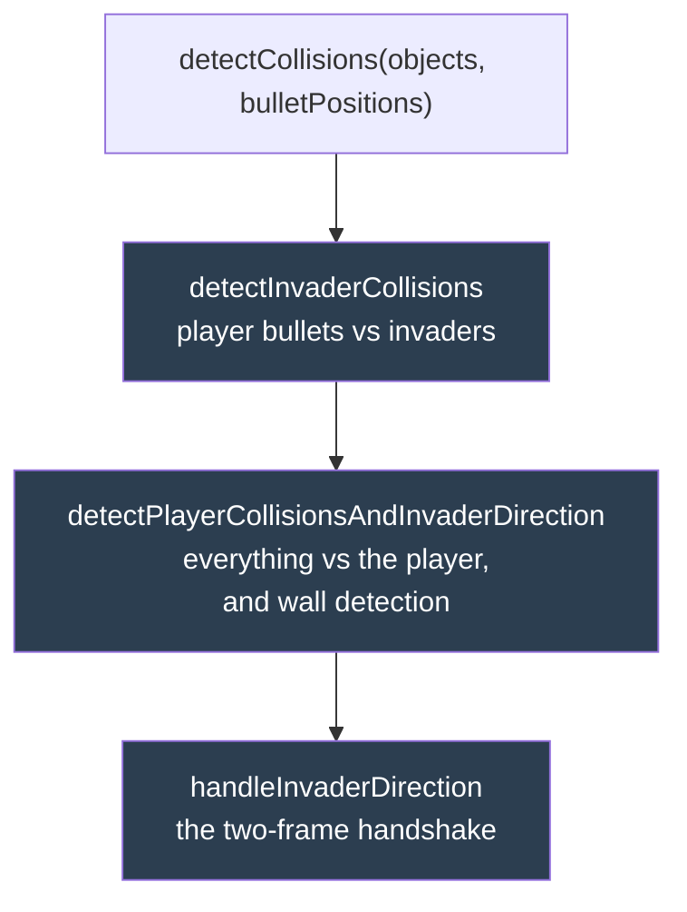
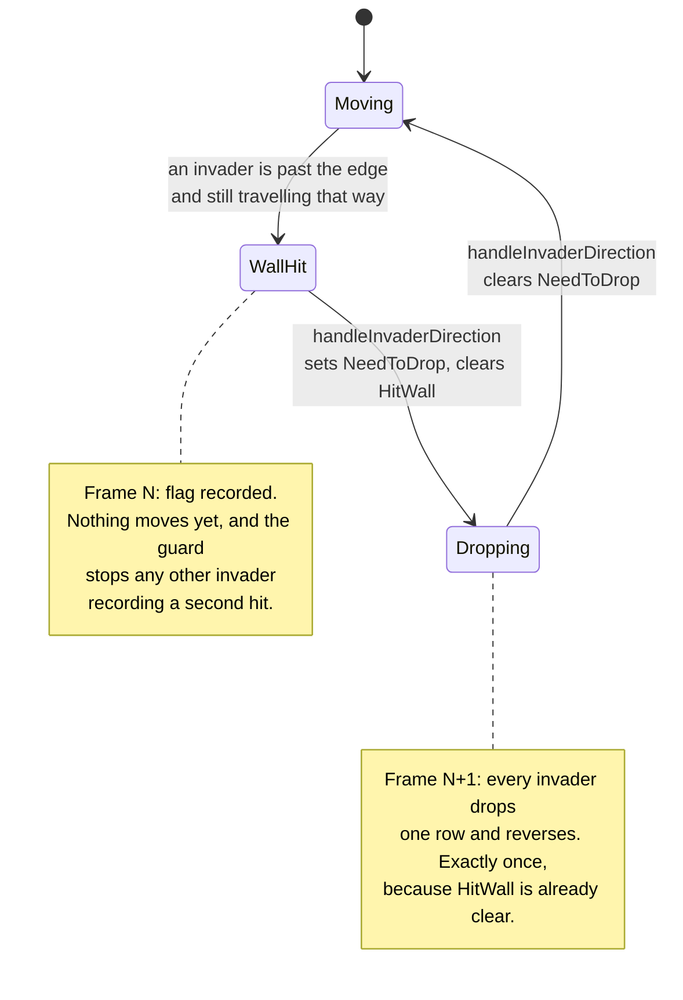

# 07 — Collision detection

## Overview

`PhysicsEnginePlayMode` answers three questions every frame: did a player bullet
hit an invader, did anything hit the player, and has the invader formation
reached a wall. The geometry is the easiest part — axis-aligned rectangle
overlap, which SFML provides.

Everything hard here is *bookkeeping*: making sure one bullet kills one invader
exactly once, that the formation drops exactly once when it hits a wall, and that
the collider a rectangle test uses actually matches where the object is drawn.
Every bug in this file was a bookkeeping bug, not a maths bug.

## ELI5

Every object carries an invisible cardboard box around it. Collision is asking
"do these two boxes overlap?" — which for boxes that are square to the world is
four comparisons.

The hard part isn't the boxes. It's the rules.

If two bullets touch the same invader in the same instant, the invader must die
*once*, not twice — otherwise your count of remaining invaders goes wrong and the
level ends early. If a bullet is sitting in a box off-stage waiting to be used, it
must not count as hitting anything. And when the front-left invader reaches the
wall, the *whole formation* must drop one row together — exactly once, not once
per invader.

Those are the rules that were broken here, not the box-overlap test.

## For a SWE

### The geometry

Colliders are `sf::FloatRect` — an axis-aligned bounding box (AABB), stored as
left/top/width/height. Overlap is:

```
A and B overlap  ⟺  A.left < B.right  and  B.left < A.right
                and  A.top  < B.bottom and  B.top  < A.bottom
```

`FloatRect::intersects` does exactly that. AABB tests are cheap and have no
rotation support — fine for a game whose sprites never rotate.

Note this is a **strict** inequality: rectangles that merely touch edge-to-edge
have zero-area overlap and do **not** intersect. That caught me while writing the
tests — positioning a bullet exactly one height below the player produced
touching, not overlapping, rectangles and no hit.

### Colliders are a mirror, not the truth

A `TransformComponent` holds position and size. A `RectColliderComponent` holds a
separate `FloatRect` that must be kept in sync by hand:

```cpp
void PlayerUpdateComponent::update(float dt)
{
    m_TC->getLocation().x -= m_Speed * dt;      // move
    m_RCC->setOrMoveCollider(                   // then mirror
        m_TC->getLocation().x, m_TC->getLocation().y,
        m_TC->getSize().x,    m_TC->getSize().y);
}
```

Every update component ends with that mirroring call. Forget it and the object
draws in one place while colliding in another — a bug with no compiler warning
and no crash, just wrong behaviour.

This is duplicated state, and the alternative (compute the rect from the
transform on demand) would remove the whole class of bug at the cost of a little
arithmetic per query. Worth knowing that the current design chose the other side
of that trade.

It also bit me directly: a test that repositioned a bullet's *transform* without
updating its *collider* asserted the wrong thing and passed for the wrong reason.

### The pass structure



### Pass 1 — bullets against invaders

```cpp
m_LiveBullets.clear();
for (const int bulletIndex : bulletPositions)
{
    GameObject& bullet = objects[static_cast<size_t>(bulletIndex)];
    const BulletUpdateComponent& update = *static_pointer_cast<BulletUpdateComponent>(
        bullet.getFirstUpdateComponent());

    if (update.m_IsSpawned && update.m_BelongsToPlayer)
    {
        m_LiveBullets.push_back(&bullet);
    }
}
if (m_LiveBullets.empty()) { return; }

for (auto invaderIt = objects.begin(); invaderIt != objects.end(); ++invaderIt)
{
    if (!invaderIt->isActive() || invaderIt->getTag() != ObjectTag::Invader) { continue; }

    for (GameObject* bulletObject : m_LiveBullets)
    {
        if (!invaderIt->getEncompassingRectCollider()
                 .intersects(bulletObject->getEncompassingRectCollider())) { continue; }

        // ...score, deactivate, de-spawn...
        break;      // one bullet, one invader
    }
}
```

Four separate bugs lived in the earlier version of this loop:

**Bullets are pooled, not created.** The level pre-allocates 14 bullet objects
parked at `(-1, -1)`; firing "spawns" one by repositioning it. So a bullet's
collider is always live even when the bullet is not — and an invader that drifted
to a negative x could be killed by a bullet sitting in the parking spot. Both
`m_IsSpawned` and `m_BelongsToPlayer` must be checked, and neither was.

**The `break` is load-bearing.** Without it, two bullets overlapping one invader
in the same frame each decrement `WorldState::NUM_INVADERS`, driving it below the
true count. `GameScreen` advances the wave when that hits zero, so the level ends
early. This is the kind of bug that shows up as "sometimes the wave ends
weirdly."

**`advance(bulletIt, bulletPositions[0])` ran unconditionally**, reading past the
end of an empty vector for a level with no bullets.

**The inner loop was the game's performance problem.** It walked from the first
bullet to the end of the object vector for *every* invader, calling
`getFirstUpdateComponent()` — which returns a `shared_ptr` **by value**, an
atomic refcount pair — on every combination. Hoisting the live-bullet gather out
made it 4.2× faster and turned quadratic growth into linear. See
[primer 11](11-performance.md).

### Pass 2 — everything against the player

```cpp
for (auto it = objects.begin(); it != objects.end(); ++it)
{
    if (!it->isActive() || !it->hasCollider() || it->getTag() == ObjectTag::Player)
    {
        continue;
    }
    // ...
}
```

That condition used to read `it->getTag() == ObjectTag::Player` **without the
negation**, and then tested inside for `Bullet` and `Invader`. An object cannot
be tagged three ways at once, so **the entire body was unreachable**: the player
could never be hit, the game had no fail state, and — because the wall detection
also lives in this loop — the invaders never dropped down or reversed.

No compiler warns about this. It is well-formed code whose meaning is not what
was intended. What catches it is running the game once, or a test asserting that
invaders descend.

Also here: the player's own bullets leave from *inside* the player's collider, so
ownership must be checked or firing would cost you a life instantly. And an
invader that reaches the player is deactivated — which means it must also be
subtracted from `NUM_INVADERS`, or that wave can never be cleared. It wasn't.

This pass is also where the invaders *win*. Overlapping the player is a
collision — one life, one dead invader — but merely arriving at the player's row
ends the game outright:

```cpp
if (currentLocation.y + currentSize.y >= playerCollider.top)
{
    m_InvadersReachedPlayer = true;
}
```

The flag is sticky, cleared only by `initialize()`, and `GameScreen` turns it into
game over. Without it nothing bounded an invader's y at all: the formation
descended below the player — who is clamped to `y >= WORLD_HEIGHT / 2` and cannot
follow — where it could be neither shot nor collided with, leaving both
`NUM_INVADERS` and `LIVES` frozen and the game unable to end. See
[§15 of the bug catalogue](09-bug-catalogue.md).

### Pass 3 — the two-frame handshake

Making a whole formation drop *once* when any one invader touches a wall is a
small distributed-consensus problem: the decision is made by one invader and
must be acted on by all of them, without acting twice.

```cpp
void PhysicsEnginePlayMode::handleInvaderDirection()
{
    if (m_InvaderHitWallThisFrame)
    {
        m_NeedToDropDownAndReverse = true;
        m_InvaderHitWallThisFrame = false;
    }
    else
    {
        m_NeedToDropDownAndReverse = false;
    }
}
```



The separation across two frames is what prevents a double-drop: on frame N+1 the
formation is still outside the bounds, so without the cleared flag it would
record another hit and drop again next frame, and again, marching down the screen.

There was a third flag, `m_InvaderHitWallPreviousFrame`, read in the condition but
**never written** — so it was always false and contributed nothing. Removed. An
always-false flag is worse than no flag: it reads like the state machine has a
case it does not have.

### What is untested

The suite covers pass 1 and pass 2 well and the handshake at a basic level. Not
covered:

- Invaders speeding up as the wave is cleared (`dropDownAndReverse` adjusts
  `m_Speed` with a formula whose operator precedence is ambiguous enough that I
  left it alone rather than guess at the intent).
- The ordering of the wave advance against the game-over checks in
  `GameScreen::update`. The invasion flag is tested first, and covered; that it
  must come *before* the wave advance — which reloads the level and resets
  `m_GameOver` — is not, because it needs a `ScreenManager`.
- The bullet pool wrapping around when all 14 are in flight.

## Related

- [02 — The game loop](02-game-loop.md) — why the delta-time clamp prevents tunnelling
- [11 — Performance](11-performance.md) — this file was the bottleneck
- [09 — The bug catalogue §5](09-bug-catalogue.md)
