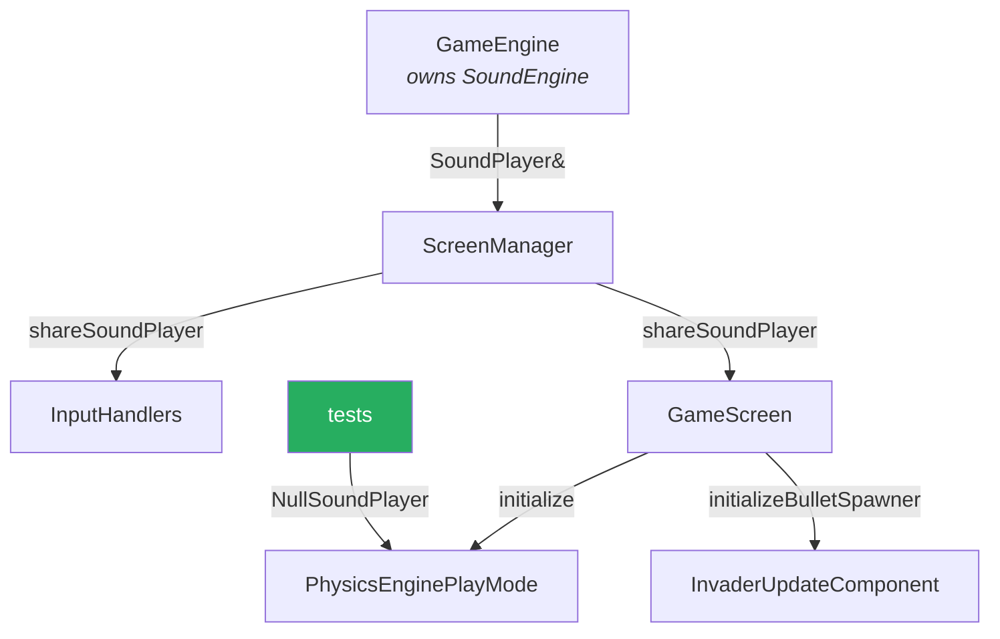

# 08 — Resource management

## Overview

The game loads three kinds of external resource: textures, fonts, and sounds.
All three were originally handled by some form of global — two hand-rolled
singletons and a set of by-value members that reloaded the same file nine times.

This primer is about how those were untangled, and about the one question that
decided *how far* to untangle each: **does making this injectable let me test
something I could not test before?** For sounds the answer was yes, and it
unblocked the most valuable tests in the project. For textures and fonts it was
no, and they got a smaller fix. Applying the same medicine to both would have
been worse.

## ELI5

Three ways to share a stapler in an office.

1. **Everyone keeps their own.** Wasteful, and when you need "the" stapler nobody
   knows which one that is. This was the fonts: every button bought its own copy
   of the same font.
2. **One stapler bolted to a desk, and everyone walks over.** Works, until you
   want to test whether someone staples correctly — you can't, because there is
   only the one real stapler and it makes noise. This was the sounds.
3. **You hand people a stapler when they arrive.** Now you can hand a tester a
   fake one that just records "would have stapled here." This is what sounds
   became.

The trick is knowing when option 3 is worth the effort. If nobody ever needs to
test the stapling, bolting it to the desk is fine.

## For a SWE

### Where it started

```cpp
// SoundEngine.h — a hand-rolled singleton
class SoundEngine {
    public:
        static void playShoot();
        static SoundEngine* m_s_Instance;
};

// SoundEngine.cpp
SoundEngine::SoundEngine() {
    assert(m_s_Instance == nullptr);
    m_s_Instance = this;
}
void SoundEngine::playShoot() { m_s_Instance->m_ShootSound.play(); }
```

`BitmapStore` had the identical shape. Both relied on someone constructing an
instance first — `GameEngine` owned a `SoundEngine`, `ScreenManager` owned a
`BitmapStore m_BS` whose *only* purpose was to trigger that assignment.

Three problems:

1. **The dependency is invisible.** `InvaderUpdateComponent::update` called
   `SoundEngine::playShoot()`. Nothing in its signature, members, or constructor
   said it needed audio.
2. **Lifetime is unmanaged.** A raw pointer to an object owned elsewhere, with an
   `assert` as the only guard. Destroy the owner and every call site dereferences
   a dangling pointer.
3. **It is untestable.** There is no seam. A test either constructs a real
   `SoundEngine` — opening an audio device and making noise — or crashes on a
   null instance.

Problem 3 is the one that mattered, because it blocked testing the collision
logic: `PhysicsEnginePlayMode` calls `playInvaderExplode()` on every hit.

### Sounds: full dependency injection

```cpp
class SoundPlayer
{
    public:
        virtual ~SoundPlayer() = default;
        virtual void playShoot() = 0;
        virtual void playPlayerExplode() = 0;
        virtual void playInvaderExplode() = 0;
        virtual void playClick() = 0;
};

class SoundEngine : public SoundPlayer { /* real, loads .ogg files */ };

class NullSoundPlayer : public SoundPlayer     // the null object pattern
{
    public:
        void playShoot() override {}
        void playPlayerExplode() override {}
        void playInvaderExplode() override {}
        void playClick() override {}
};
```

`GameEngine` owns the concrete `SoundEngine` and hands it down. The wiring reuses
the interface that already existed:

```cpp
class ScreenManagerRemoteControl
{
    // ...
    virtual SoundPlayer& shareSoundPlayer() = 0;   // mirrors shareGameObjectSharer()
};
```



That green box is the entire point. Eight collision tests exist because of it,
covering the highest-risk logic in the game, and the suite stays silent.

**Note the member ordering that this forced:**

```cpp
class GameEngine
{
    private:
        sf::RenderWindow m_Window;
        SoundEngine m_SoundEngine;                    // must come first...
        std::unique_ptr<ScreenManager> m_ScreenManager;  // ...because this is handed a reference to it
};
```

Members are initialised in **declaration order**, regardless of the order they
appear in an initialiser list. Getting this backwards would hand `ScreenManager` a
reference to a not-yet-constructed object. Compilers warn about mis-ordered
initialiser lists (`-Wreorder`) but not about this.

### Textures and fonts: a smaller fix, deliberately

Fonts had a different problem. `Button` and `UIPanel` each held an `sf::Font`
**by value** and loaded the same file in their constructors — nine reads of
`Roboto-Bold.ttf` across six buttons and three panels.

Waste was the lesser issue. The real one:

```cpp
class Button {
    sf::Text m_ButtonText;
    sf::Font m_Font;          // sf::Text stores a POINTER to this
};
```

`sf::Text::setFont` does not copy the font — it keeps a pointer. So a by-value
`Font` member must outlive every `Text` using it, and **copying the owner leaves
the copy's `Text` pointing into the original**. `Button` is only ever held via
`shared_ptr` so it was never actually copied, but the class was one refactor away
from a dangling pointer.

Both stores now use a function-local static:

```cpp
const sf::Font& FontStore::get(const std::string& filename)
{
    static std::map<std::string, sf::Font> loaded;   // inside a function
    // ...load on first request, throw on failure
}
```

A function-local `static` is initialised **on first use**, and that
initialisation is thread-safe from C++11 onward. Crucially it is *not* subject to
the **static initialisation order fiasco**: two namespace-scope objects in
different translation units have no defined initialisation order between them, so
one constructor using the other is a coin flip. That is exactly the hazard the
old `static BitmapStore* m_s_Instance` lived with — and the same reason
`WorldState`'s members were consolidated into one translation unit.

**Why not inject these too?** Because the test would be identical either way.
Textures and fonts are touched only during construction — never per frame, never
by a test, because anything drawing needs a window the test suite does not
create. Injection would add plumbing through the factory and every UI class in
exchange for nothing testable. `FontStore.h` says so in a comment, so the
inconsistency reads as a decision rather than an oversight.

> The general rule this project ended up at: **make a dependency injectable when
> it has a seam you will actually use.** "Globals are bad" is not a reason on its
> own; "I cannot test the collision logic" is.

### The destruction-order trap this introduced

Function-local statics are destroyed **after `main()` returns**. `~sf::Texture`
needs a live OpenGL context to release its GPU handle — and the context dies with
the window, which happens inside `main`.

So the stores expose explicit teardown:

```cpp
GameEngine::~GameEngine()
{
    BitmapStore::clear();
    FontStore::clear();
}
```

A destructor body runs **before** any member is destroyed, so `m_Window` — and
its context — is still alive at that point.

This is a general hazard with GPU- or driver-backed resources in static storage,
and worth recognising: *the resource outliving the subsystem that created it* is
a different failure from the usual "used after free."

### Failures that used to be silent

Every `loadFromFile` in this codebase returned a `bool` that was discarded.

```cpp
m_PlayerExplodeBuffer.loadFromFile("sound/playerExplode.ogg");   // returns bool. ignored.
```

The file on disk is `playerexplode.ogg`. macOS's default filesystem is
case-insensitive, so this worked here and **fails on Linux** — a strong candidate
for why sound never worked on the VM this project was originally developed on.

A missing texture was worse than silent:

```cpp
auto textureSize = m_Sprite.getTexture()->getSize();   // 0 x 0
m_Sprite.setScale(objectSize.x / textureSize.x, ...);  // divide by zero -> inf/NaN
```

so a typo'd asset name surfaced as invisible sprites or NaN positions rather than
an error. Every load is now checked and throws with the filename.

> Discarding a `bool` that reports failure is how a small mistake becomes an
> unexplainable one. `[[nodiscard]]` exists for this; SFML 2 predates its
> widespread use, so the discipline has to be yours.

## Related

- [03 — Screens and dependency inversion](03-screens-and-dependency-inversion.md) — the wiring reused here
- [10 — Testing](10-testing.md) — what the SoundPlayer seam unlocked
- [09 — The bug catalogue §10](09-bug-catalogue.md)
