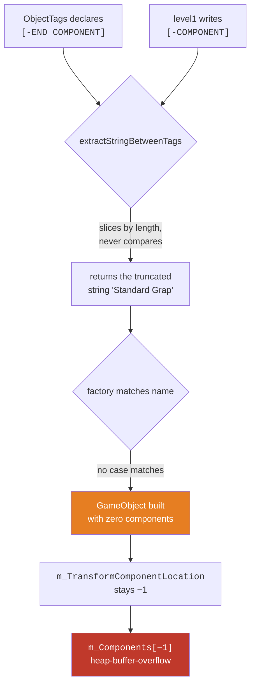

# 09 — The bug catalogue

## Overview

This codebase had never been compiled. Not "had bugs" — had never been through a
compiler at all, because the very first header in the dependency graph contained
`#include <GameObjectSharer.h"`, with a `<` opening and a `"` closing.

That matters for reading everything below. Code that has never met a compiler
accumulates a specific kind of damage: names drift between declaration and
definition, types quietly disagree, and whole branches turn out to be
unreachable — because nothing ever pushed back. Once it compiled, a second layer
appeared underneath: logic that builds fine and is simply wrong.

This primer walks the real defects, grouped by the language rule each one turns
on. Every example is code that was actually in this repo.

## ELI5

Imagine building a model ship over several weekends, and never once looking at
it in good light.

- One plank was labelled for the left side and cut for the right. Nobody
  noticed, because you never held them together.
- The instructions said "attach part **A-END**", and the bag of parts contained
  a part called **A**. Not the same name, so you attached nothing — and the
  gap was hidden inside the hull.
- You wrote "put the mast at position X" but your hand wrote the height field
  instead. Every mast ended up the wrong height at position zero.
- One instruction said "for every part that is the hull, do this to the sails."
  Nothing is both, so that page of instructions did nothing at all.

None of these are exotic. They are all "two things that had to match, didn't,
and nothing checked."

## For a SWE

### 1. The include that stopped everything

```cpp
// Component.h, line 2
#include <GameObjectSharer.h"
```

`<...>` and `"..."` are different include forms, and you cannot mix them. Clang
reports `expected '>'`. `Component.h` is included, directly or transitively, by
nearly every other header — so this single character sequence meant no
translation unit in the project ever compiled.

**The lesson isn't "typos happen."** It's that a project without a build system
has no floor. There was no `CMakeLists.txt`, no `Makefile`, nothing. The
feedback loop that would have caught this in under a second never existed.

### 2. Returning a reference to nothing

```cpp
FloatRect& GameObject::getEncompassingRectCollider()
{
    if (m_HasCollider)
    {
        return /* ... the real collider ... */;
    }
    // ...and if it doesn't? Nothing. No return statement.
}
```

Falling off the end of a non-`void` function is **undefined behaviour**. It is
not "returns garbage" in any defined sense — the optimiser is entitled to assume
the branch is unreachable and delete surrounding code. Here the caller receives
a `FloatRect&` bound to whatever happened to be in the return register.

Clang catches this with `-Wreturn-type`, which is on by default. It had simply
never been run.

The same shape appeared twice more, both as *deliberate* fallbacks:

```cpp
// GameObject::getComponentByTypeAndSpecificType — component not found
return m_Components[0];

// LevelManager::findFirstObjectWithTag — tag not found
return m_GameObjects[0];
```

These are worse than the accidental one, because they look like error handling.
Every caller immediately does this:

```cpp
static_pointer_cast<PlayerUpdateComponent>(
    player.getComponentByTypeAndSpecificType("update", "player")
);
```

`static_pointer_cast` performs **no check**. Handing it the wrong component type
produces a pointer that is used as if it were a `PlayerUpdateComponent`, and the
corruption surfaces somewhere else entirely. And `m_GameObjects[0]` on an *empty*
vector — which happens whenever the level file fails to open — is a read past the
end.

All three now throw with a message naming the object:

```cpp
throw std::runtime_error(
    "GameObject::getComponentByTypeAndSpecificType - object tagged \"" + m_Tag +
    "\" has no component of type \"" + type + "\" / \"" + specificType + "\""
);
```

> **Rule of thumb:** if a function returns a reference and can fail, it must
> either throw, or return a pointer that can be null, or return
> `std::optional<std::reference_wrapper<T>>`. Never a reference to a stand-in.

### 3. Indexing with −1

`GameObject` caches where each component sits:

```cpp
int m_TransformComponentLocation = -1;   // "not found yet"
```

and reads it back unguarded:

```cpp
return static_pointer_cast<TransformComponent>(m_Components[m_TransformComponentLocation]);
```

`std::vector::operator[]` takes an unsigned `size_type`. Passing `-1` converts to
`SIZE_MAX`, and the implementation computes `data() + SIZE_MAX`, which wraps to
16 bytes *before* the array. AddressSanitizer reported it precisely:

```
ERROR: AddressSanitizer: heap-buffer-overflow
READ of size 8 at 0x602000014960
  #2 GameObject::getTransformComponent() GameObject.cpp:42
0x602000014960 is located 16 bytes before 16-byte region [...]
```

This was not theoretical. It happened on the very first object of the very first
level, for the reason in §4.

### 4. Two halves of a format that nothing forced to agree

The worst bug in the project, and the most instructive.

`ObjectTags.cpp` declared:

```cpp
const string ObjectTags::COMPONENT     = "[COMPONENT]";
const string ObjectTags::COMPONENT_END = "[-END COMPONENT]";
```

`world/level1` contains:

```
[COMPONENT]Standard Graphics[-COMPONENT]
```

`[-END COMPONENT]` and `[-COMPONENT]` are different strings. Every other closing
tag in the format follows the `[-X]` convention — `[-NAME]`, `[-WIDTH]`,
`[-LOCATION X]` — so the *constant* was the outlier, not the data.

Now the part that made it invisible. The extractor did not search for tags; it
sliced by their **lengths**:

```cpp
int start = startTag.length();
int count = stringToSearch.length() - startTag.length() - endTag.length();
return stringToSearch.substr(start, count);
```

So instead of failing, it returned a plausible-looking truncation:

```
"[COMPONENT]Standard Graphics[-COMPONENT]"   length 40
start = 11, count = 40 - 11 - 16 = 13
              -> "Standard Grap"
```

`GameObjectFactoryPlayMode` compares against `"Standard Graphics"`, `"Transform"`,
`"Invader Update"`. `"Standard Grap"` matches nothing. **Every GameObject in
every level was built with no graphics, no transform, and no update component.**



A length-based slice also has a nastier property: it produces a *correct* answer
whenever the two tags happen to be the same length. That is exactly why the
second mismatch in the same file went unnoticed for years —
`[-ENCOMPASSING_RECT COLLIDER]` (underscore, in the data) and
`[-ENCOMPASSING RECT COLLIDER]` (space, declared) are both 29 characters, so
collider tags parsed correctly *by coincidence*.

The fix searches for the actual tags and trims whitespace:

```cpp
const size_t startTagPosition = stringToSearch.find(startTag);
if (startTagPosition == string::npos) { return ""; }

const size_t valueStart = startTagPosition + startTag.length();
const size_t endTagPosition = stringToSearch.find(endTag, valueStart);
if (endTagPosition == string::npos) { return ""; }

string extracted = stringToSearch.substr(valueStart, endTagPosition - valueStart);
// ...then trim " \t\r\n", which also handles CRLF checkouts
```

The trim matters independently: `getline` leaves a `\r` on every line of a file
with Windows line endings, and that `\r` used to go straight into `std::stof`,
which throws `std::invalid_argument`. Nothing caught it.

> **The real lesson.** A data format has two implementations — the writer and the
> reader — and the compiler checks neither against the other. `tests/test_level_data.cpp`
> now reads the real level file and asserts that every opening tag is closed by
> the tag the code declares, and that every component name is one the factory can
> actually build. That test fails if either half drifts.

### 5. A condition that made its own body unreachable

```cpp
for (auto it = objects.begin(); it != objects.end(); ++it)
{
    if (it->isActive() && it->hasCollider() && it->getTag() == "Player")
    {
        if (currentCollider.intersects(playerCollider))
        {
            if (it->getTag() == "bullet")  { /* player loses a life */ }
            if (it->getTag() == "invader") { /* invader reaches the player */ }
        }
        // ...and below this, the entire drop-down-and-reverse logic
    }
}
```

The outer test admits only objects tagged `"Player"`. The inner tests ask whether
that same object is tagged `"bullet"` or `"invader"`. A `std::string` cannot equal
three different values at once, so **nothing inside ever ran**: the player could
not be hit, the game had no fail state, and the invaders never dropped down or
reversed direction.

It should be `!=` — "everything except the player."

No compiler warns about this. It is well-formed code whose meaning is simply not
what was intended. What would have caught it is a test asserting that invaders
descend, which is now `tests/` territory, or simply running the game once.

**And it happened twice.** The gamepad fire button had the same shape:

```cpp
bool mButtonPressed = false;                              // GameInputHandler.h

if (Joystick::isButtonPressed(0, 1) && mButtonPressed)    // .cpp
{
    mButtonPressed = false;                               // the only assignment
    // ...fire...
}
```

`mButtonPressed` is initialised `false`, tested with `&&`, and only ever
*assigned* `false`. Nothing sets it `true`, so the branch is unreachable and
**gamepad firing never worked at all**. Keyboard firing was unaffected, which is
why nobody would notice without a controller plugged in.

The intent is clearly a debounce — fire on the press, not on every frame the
button is held — with the condition inverted and the release case missing. The
correct shape tracks the previous state and fires on the rising edge:

```cpp
const bool fireButtonDown = Joystick::isButtonPressed(0, 1);
if (fireButtonDown && !m_FireButtonWasDown) { /* fire */ }
m_FireButtonWasDown = fireButtonDown;
```

Two unreachable branches in one codebase is not a coincidence. Both are
**boolean conditions that can never be true**, and no compiler diagnoses them:
the code is well-formed, and the values are only knowable at runtime. Clang's
static analyser and `clang-tidy` catch a subset; the reliable detection is a test
that asserts the effect, or running the thing once.

Two smaller logic errors sat nearby:

```cpp
if (WorldState::LIVES == 0) { m_GameOver = true; }
```

Two hits in one frame step from 1 to −1 and skip the equality entirely — the game
never ends. `<= 0`.

And an invader that reaches the player was deactivated but never subtracted from
`NUM_INVADERS`, so that wave could never be cleared.

### 6. Integer division, twice

```cpp
float screenRatio = VideoMode::getDesktopMode().width / VideoMode::getDesktopMode().height;
```

Both operands are `unsigned int`. The division happens in integer arithmetic and
*then* converts to `float`. On any display narrower than 2:1, `1920/1080` is `1`.
`WORLD_HEIGHT` became 100 instead of ~56, so every piece of world geometry — where
the player is clamped, when a bullet counts as off-screen — was computed from the
wrong number.

The same shape in `UIPanel`:

```cpp
float viewportStartX = 1.f / (res.x / x);
```

The `1.f` makes the *outer* division floating-point, which is exactly why this
reads as correct at a glance. The inner `res.x / x` is still `int / int`. The
value wanted is simply `x / res.x`.

> **Pattern to internalise:** the type of `a / b` is decided by `a` and `b` alone.
> A float somewhere else in the expression does not reach back and change it.
> Cast an operand, not the result.

### 7. Uninitialised members

```cpp
class GameObjectBlueprint {
    float m_Width;      // no initialiser
    float m_Height;
    float m_LocationX;
    float m_LocationY;
};
```

For a class with no user-provided default constructor, these have
**indeterminate** values. Reading one is undefined behaviour. Any level file
omitting a tag produced an object built from whatever was on the stack.

Compounded by this, which is the single most consequential typo in the repo:

```cpp
void GameObjectBlueprint::setLocationX(float locationX) { m_Height = locationX; }
void GameObjectBlueprint::setLocationY(float locationY) { m_Height = locationY; }
```

Both location setters wrote the *height*. So `m_LocationX` and `m_LocationY` were
never assigned at all — every object read its position from an indeterminate
value, and its height was whichever location was parsed last.

Default member initialisers cost nothing and remove the whole category:

```cpp
float m_Width = 0.f;
float m_Height = 0.f;
```

The test is one line per property, and it is in
`tests/test_game_object_blueprint.cpp`.

### 8. Virtual destructors, and when you actually need one

```cpp
map<string, unique_ptr<Screen>> m_Screens;
m_Screens["Game"] = unique_ptr<GameScreen>(new GameScreen(this, res));
```

`Screen` had no virtual destructor. Deleting a `GameScreen` through a
`unique_ptr<Screen>` is undefined behaviour — `~GameScreen` never runs, and the
`GameInputHandler` and background texture it owns are never released. Clang says
so directly: `-Wdelete-non-abstract-non-virtual-dtor`.

**But `shared_ptr<Component>` was fine without one**, and understanding why is
worth more than the fix:

```cpp
vector<shared_ptr<Component>> m_Components;   // safe, even before the fix
map<string, unique_ptr<Screen>> m_Screens;    // UB before the fix
```

`shared_ptr` captures the deleter at *construction*, when the concrete type is
still known. `make_shared<StandardGraphicsComponent>()` stores a deleter that
calls `~StandardGraphicsComponent`, and that survives the conversion to
`shared_ptr<Component>`. This is type erasure, and it is the reason `shared_ptr`
is forgiving here.

`unique_ptr<T>`'s deleter is part of its *type* — `std::default_delete<T>` — so
`unique_ptr<Screen>` will only ever call `delete` on a `Screen*`. No erasure, no
rescue.

> Every polymorphic base in this codebase now declares
> `virtual ~T() = default;`. The rule is easier to remember than the exception,
> and the cost is one vtable slot on classes that already have a vtable.

### 9. An iterator hoisted out of the wrong loop

```cpp
Event event;
auto it = m_InputHandlers.begin();
auto end = m_InputHandlers.end();
while (window.pollEvent(event))
{
    for (; it != end; ++it) { (*it)->handleInput(window, event); }
}
```

`it` is created **once**, outside the `while`. The first event walks it to
`end()`. Every subsequent event that frame enters a `for` loop whose condition is
already false — so the event is polled, consumed, and silently dropped. Press two
keys in one frame and only the first is seen.

Declaring the iterator in the loop that uses it removes the bug and the two
variables:

```cpp
while (window.pollEvent(event))
{
    for (auto it = m_InputHandlers.begin(); it != m_InputHandlers.end(); ++it)
    {
        (*it)->handleInput(window, event);
    }
}
```

Related, and everywhere in this codebase: `for (it; it != end; ++it)`. That first
`it` is an expression statement that evaluates a variable and discards it — a
no-op. It is what `-Wunused-value` was complaining about 14 times.

### 10. Failures that made no sound — literally

```cpp
m_PlayerExplodeBuffer.loadFromFile("sound/playerExplode.ogg");
```

The file on disk is `playerexplode.ogg`. macOS's default filesystem is
case-insensitive, so this worked here and **fails on Linux** — a good candidate
for why sound never worked on the VM this project was originally developed on.

And `loadFromFile` returns a `bool` that every call site discarded. A missing
texture produced a 0×0 `sf::Texture`, and then:

```cpp
m_Sprite.setScale(float(objectSize.x) / textureSize.x, ...);   // divide by zero
```

so a mistyped asset name surfaced as invisible sprites or NaN positions rather
than as an error. Every load is now checked and throws on failure.

> Ignoring a return value that reports failure is how a small mistake becomes an
> unexplainable one. `[[nodiscard]]` exists for exactly this; SFML 2 predates its
> widespread use, so the discipline has to be yours.

### 11. Re-seeding a random generator in a loop

```cpp
// inside InvaderUpdateComponent::update(), i.e. every shot
srand(m_RandSeed);
m_TimeBetweenShots = (((rand() % 10)) + 1) / WorldState::WAVE_NUMBER;

// inside BulletUpdateComponent::spawnForInvader(), i.e. every spawn
srand((int)time(0));
```

Three separate problems:

1. **Re-seeding destroys randomness.** `srand(x); rand()` returns the same value
   for the same `x`, always. Seeding inside the function that draws from the
   generator means every invader with the same seed produces an identical
   sequence, and `srand(time(0))` makes every bullet spawned in the same second
   travel at the same speed.
2. **The seed was an array index.** `m_RandSeed` was the object's position in the
   `GameObject` vector, and it was also added directly to the first shot delay:
   `rand() % 15 + randSeed`. With 45 invaders, the back rows waited up to
   59 seconds before firing once.
3. **Integer division again.** `((rand() % 10) + 1) / WAVE_NUMBER` is `int / int`.
   From wave 11 onward it is `0`, and the invader fires on every frame.

Replaced by a single engine seeded once (`Random.h`), using a function-local
static:

```cpp
std::mt19937& Random::engine()
{
    static std::mt19937 e{std::random_device{}()};
    return e;
}
```

A function-local `static` is initialised on first use, and that initialisation is
thread-safe from C++11 on. At namespace scope it would be exposed to the static
initialisation order problem — which is the same hazard that made `WorldState`'s
members worth consolidating into one translation unit, instead of the four
unrelated ones they were scattered across.

### 12. Names that drifted because nothing compared them

A cluster that only exists because the code was never built:

| Declared | Defined | Result |
|---|---|---|
| `setTag(String)` (`sf::String`) | `setTag(string)` | no matching declaration |
| `getEncompassingRectColliderTag()` | `getEncompassingColliderTag()` | out-of-line definition matches nothing |
| `intializeGraphics(...)` | `initializeGraphics(...)` | class stays abstract; `make_shared` fails |
| `start(GameSharerObject*)` | type is `GameObjectSharer` | unknown type name |
| `string m_Enabled = false;` | wanted `bool` | no viable conversion |
| `component->getSpecificType` | wanted `getSpecificType()` | comparing a member function to a string |

Two more of the same family, in the debug-logging blocks:

```cpp
#define debuggingConsole            // DevelopState.h defines this

#ifdef debuggingErrors              // GameObject.cpp tests this
#ifdef debuggingOnConsole           // BitmapStore.cpp tests this
```

Three spellings, no two alike, so every diagnostic block was dead — and one of
them contained `<< end;` instead of `<< endl;`, which would have failed to
compile the moment anyone enabled it. Preprocessor conditionals are the one place
the compiler cannot help you, because unreached code is never parsed. The fix
routes all of them through one build-controlled macro, and the build is now run
with it on to prove the blocks still compile.

### 13. A modelling error, not a typo

```cpp
class TransformComponent : public GraphicsComponent
```

A transform is not a kind of graphics. This inheritance was wrong in three
separate ways at once:

- `GraphicsComponent.h` includes `TransformComponent.h`, so the base was not even
  visible at the point of derivation — a circular include.
- `GraphicsComponent` declares `draw()` and `initializeGraphics()` as pure
  virtual. `TransformComponent` implements neither, so it was **abstract**, and
  `make_shared<TransformComponent>(...)` in the factory could not compile.
- It gave every transform a redundant second `m_Type` member shadowing the base's.

The fix is one word — derive from `Component` — but the useful part is noticing
that "X has a Y" and "X is a Y" got swapped. A transform *holds* position data
that graphics *reads*. That is collaboration, not inheritance.

### 14. Tests that pass for the wrong reason

Three separate times in this project, a test that was *written to catch a
specific bug* did not catch it — and only mutation testing revealed that.

**The double-kill test spawned one bullet.** It asserted that an invader dies
once, and passed. But the `break` it claimed to guard only matters when *two*
bullets overlap the same invader in one frame. Removing the `break` did not
break the test. Fixed by spawning two.

**The parked-bullet test used a never-spawned bullet.** It asserted that a bullet
which is not in flight cannot score, and passed. But a never-spawned bullet also
has `m_BelongsToPlayer == false`, so the *ownership* check rejected it before
`m_IsSpawned` was ever consulted. Deleting the `m_IsSpawned` check did not break
the test. Fixed by spawning a player bullet and then de-spawning it — the state a
bullet is actually in after leaving the screen.

**Nothing tested the ownership half at all.** Discovered when a mutation that
removed `m_BelongsToPlayer` from the condition left the whole suite green. There
was no case where an *invader's* bullet overlapped an invader. Added.

The method that found all three:

```
reintroduce the bug -> rebuild clean -> the suite must go red
```

If it stays green, the test is decorative. This is mutation testing in its
simplest manual form, and on this project it had roughly a 30% hit rate against
tests I had just written and believed in.

> **A test that has never failed has never been tested.** Watching it fail is not
> a formality; it is the only evidence that the assertion is connected to the
> behaviour.

One practical trap while doing this: **incremental builds lied three times.**
Make's one-second timestamp granularity lost races with a fast edit-build-test
loop, reporting "passes" against a stale binary. Every result above was
re-confirmed with a clean rebuild. If a C++ test result surprises you immediately
after a revert, distrust the build before you distrust the test.

### 15. A rule that was never written

```cpp
if (WorldState::NUM_INVADERS <= 0) { /* next wave */ }
if (WorldState::LIVES <= 0)        { m_GameOver = true; }
```

Those two checks in `GameScreen::update` were the only ways a game could end.
Now play it, and let the invaders come down:

```cpp
void InvaderUpdateComponent::dropDownAndReverse()
{
    m_MovingRight = !m_MovingRight;
    m_TC->getLocation().y += m_TC->getSize().y;   // no upper bound, ever
```

The physics engine bounds invaders in x — that is what triggers the drop — and in
x only. Nothing in the codebase ever compared an invader's y to anything at all.

So the formation walks down to the player's row, through it, and off the bottom of
the view. And because there is no despawn in this project — "removal" is
`location = (-1, -1)` plus `setInactive()` — those invaders are still active,
still counted in `NUM_INVADERS`, still being drawn somewhere below the window. The
player is clamped to `y >= WORLD_HEIGHT / 2` and cannot follow them. They cannot
be shot. They cannot collide with anything.

Both exit conditions are now unreachable. `NUM_INVADERS` can never fall to zero,
so the wave never advances; `LIVES` can never fall at all, so the game never ends.
It does not merely fail to end — it soft-locks, with a live player, a full three
lives, and nothing left on screen to play against. Escape is the only way out.

The fix is four lines in the pass that already holds the invader's transform and
the player's collider:

```cpp
if (currentLocation.y + currentSize.y >= playerCollider.top)
{
    m_InvadersReachedPlayer = true;
}
```

plus one check in `GameScreen::update`, placed *ahead* of the wave advance —
because that path reloads the level, and `initialize()` would clear `m_GameOver`
straight back to `false`.

The shape of this defect is what makes it worth cataloguing, because it is unlike
the fourteen above. Every one of those is two things that disagree: a declaration
and a definition, a format and its parser, a condition and its own body. There is
a **wrong thing to point at**. Here nothing disagreed with anything. Every line
was consistent, compiled clean, and passed the suite. The rule "the invaders win
by arriving" had simply never been written down, and an absence has no wrong line.

Which is also why no tool found it. `-Wall -Wextra -Wpedantic` sees nothing to
warn about; the sanitizers see well-defined behaviour; mutation testing cannot
mutate code that is not there; and tests only ever assert the rules someone
thought to assert. Coverage was not the gap —
`detectPlayerCollisionsAndInvaderDirection` was among the best-covered functions
in the repo, and every existing test still passed after the fix. What finds a
missing rule is knowing what the game is supposed to do, and then playing it.

> **Coverage measures the code you wrote. It says nothing about the code you
> forgot to write.**

### 16. One absolute number in a relative layout

Every dimension of the title panel is a fraction of whatever display the game
happens to open on:

```cpp
UIPanel(res, (res.x/10)*2, res.y/3, (res.x/10)*6, res.y/3, ...)
m_ButtonWidth   = res.x / 20;
m_ButtonPadding = res.x / 100;
```

Every dimension except the one that decides how wide the text actually is:

```cpp
m_Text.setCharacterSize(160);   // pixels, and only pixels
```

"SPACE INVADERS" in Roboto-Bold at 160px measures 1267px. The panel is 60% of
`res.x`, so the title needs a display about 2200px wide. On the 1710×1107 desktop
this was developed on — windowed at 0.8, so `res.x` is 1368 — the panel is 816px
and the title had 790px to live in. 62% of it rendered. The screen read
**SPACE INVA**.

What makes this one worth cataloguing is the *failure mode*, not the arithmetic.
`sf::View` clips to its viewport, so the overflow was not drawn somewhere wrong,
overlapping something, or off the window edge where you might notice it. It was
cut at the panel boundary, cleanly, along a straight vertical line that looks
exactly like a design decision. The same panel on a wider display is correct. The
bug is a property of the machine it runs on, and it is invisible on the machine
that produced it if that machine is big enough.

The fix is not a better constant — a better constant is the same bug with a
different threshold. It is to measure:

```cpp
TextFit::fitToWidth(m_Text, m_Width - (m_ButtonPadding * 2),
                    TextFit::sizeForHeight(160, m_Height - titleTop));
```

160 survives as a ceiling rather than a promise. `getLocalBounds()` was never
called anywhere in this codebase before; nothing had ever asked how wide a string
was, which is why every text-bearing class carried some version of the defect.
`GameOverUIPanel` used 60px in a 30%-wide panel and the score HUD used 60px in a
33%-wide one; the HUD was clipping on *every* resolution tested, including a
3024px fullscreen one, and nobody had reported it.

`Button` deserves its own note, because it looked like the one class that had got
this right:

```cpp
m_ButtonText.setCharacterSize(height * .7f);
```

That scales with the button, which is why it reads as safe — and it is still the
same bug, because it asks about the wrong axis. A button is `res.x/20` wide no
matter what its label says. `"Play"` fitted and `"Home"` did not, so on a small
window the game-over screen showed a red box with its own label hanging off the
right-hand side. It was only spotted by rendering the panel and looking at it,
after the three obvious cases had already been fixed.

> **"It scales" is not the same claim as "it fits."** Deriving a size from *a*
> dimension of the container feels like measuring. Measuring is comparing against
> the dimension that actually constrains you.

The sizing arithmetic lives in `TextFit::largestSizeThatFits`, which takes its
measurement as a callback. That is what makes it testable: the tests feed it a
fake font, so the first coverage this project has of anything render-adjacent
still opens no window and loads no assets.

> **A layout mixing relative and absolute units has a resolution at which it is
> correct, and you are probably sitting at it.**

## What actually found these

| Tool | Found |
|---|---|
| The compiler (`-Wall -Wextra -Wpedantic`) | 11 errors, then ~28 warnings including the missing virtual destructors, the no-return path, and every dead field |
| AddressSanitizer | `m_Components[-1]`, which led back to the component tag mismatch |
| UndefinedBehaviorSanitizer | the unsigned pointer-offset overflow underneath it |
| Reading the code | the `== "Player"` inversion, the location setters, the case-sensitivity trap |
| A benchmark | the `shared_ptr` returned by value in the collision inner loop |
| Mutation testing | three tests that passed for the wrong reason, and one missing case |
| Playing it | the missing invasion rule — invaders walked off the bottom of the screen and the game carried on |
| Looking at it | the clipped title — a defect that only exists below a certain screen width, and that a screenshot states in full |
| Tests | now pin all of the above so they cannot come back |

The ordering is the point. The compiler is free and instant and found the most.
Sanitizers found the one thing that looked fine and was corrupting memory.
Careful reading found the logic errors that are, by construction, invisible to
both. A benchmark found the one that was merely slow. And mutation testing found
the bugs in the *tests* — the layer everything else was trusting.

Playing it sits at the end of that list for a reason: it is the only one that can
find a rule nobody wrote. Every tool above compares the code against something —
the language, the memory model, itself. None of them can compare it against a game
that does not exist yet.

You need all of them, and they are ordered by cost. Run the cheap ones first and
constantly.

## Still open

Honest list of things known and not fixed:

- **`map::operator[]` in `switchScreens`.** A typo'd screen name silently inserts
  a null `unique_ptr<Screen>`, and the next frame dereferences it. `.at()` would
  throw.
- **`[SPEED]` is parsed but unused.** The level file says the player's speed is
  10; the code hardcodes 50. The data and the code disagree and the code wins.
- **`dropDownAndReverse`'s speed formula** has ambiguous operator precedence.
  Working the arithmetic showed it roughly doubles invader speed over a wave,
  which is plausible escalation rather than a bug — so it was left alone rather
  than changed on a guess about intent.
- **An unrecognised component name is silently ignored** by the factory. A test
  covers `world/level1`; the factory itself stays quiet.
- **Almost no test covers rendering, input handling, or screen transitions.** By
  construction — they need a window. `TextFit` is the one foothold, and it exists
  only because the measurement was pulled out behind a callback. The same move is
  available for the rest of the layout arithmetic and has not been made.
- **The HUD is sized for its worst-case string, so it is small on a small
  window.** Fitting `"Score: 999999   Lives: 9   Wave: 99"` into a panel a third
  of the screen wide lands on 27px at 1368×886. Legible and not clipped, which is
  strictly better than before — but the real fix is a wider HUD panel, and that is
  a design change rather than a bug fix.

## Related

- [10 — Testing C++ with doctest](10-testing.md) — how each of these got pinned
- [01 — Architecture overview](01-architecture-overview.md) — where these classes sit
